Integrated dataset script
================
Garcia Rivas, J.
2026-06-17

# Integration script

This is the workflow performed to integrate our datasets seen in this
paper. This Rmarkdown script is fully reproducible as well as providing
the output for the different parameters (e.g. QCs) used to integrate
datasets.

# Libraries needed

``` r
library(dplyr)
library(Seurat)
library(patchwork)
library(tibble)
library(scCustomize)
library(ggplot2)
```

# Workflow for the basal plate sc dataset

## Creating the Seurat objects

``` r
#Creating Seurat Objects
pla_25_6 <- CreateSeuratObject(counts = pla_25_6.data, project = 'Non-labored 1', min.cells = 3, min.features = 100)
pla_25_7 <- CreateSeuratObject(counts = pla_25_7.data, project = 'Non-labored 2', min.cells = 3, min.features = 100)
pla_020325 <- CreateSeuratObject(counts = pla_020325.data, project = 'Labored 1', min.cells = 3, min.features = 100)
pla_021125 <- CreateSeuratObject(counts = pla_021125.data, project = 'Labored 2', min.cells = 3, min.features = 100)
pla_022025 <- CreateSeuratObject(counts = pla_022025.data, project = 'Labored 3', min.cells = 3, min.features = 100)
pla_052725 <- CreateSeuratObject(counts = pla_052725.data, project = 'Labored 4', min.cells = 3, min.features = 100)

#Merging objects
placenta <- merge(x = pla_25_6, y = c(pla_25_7, pla_020325, pla_021125, pla_022025, pla_052725))
```

## QC metrics

``` r
#Filtering the data
placenta[['percent.mt']] <- PercentageFeatureSet(placenta, pattern = '^MT-')
p1 <- VlnPlot(placenta, features = c('nFeature_RNA', 'nCount_RNA', 'percent.mt'), group.by = 'orig.ident')
p1
```

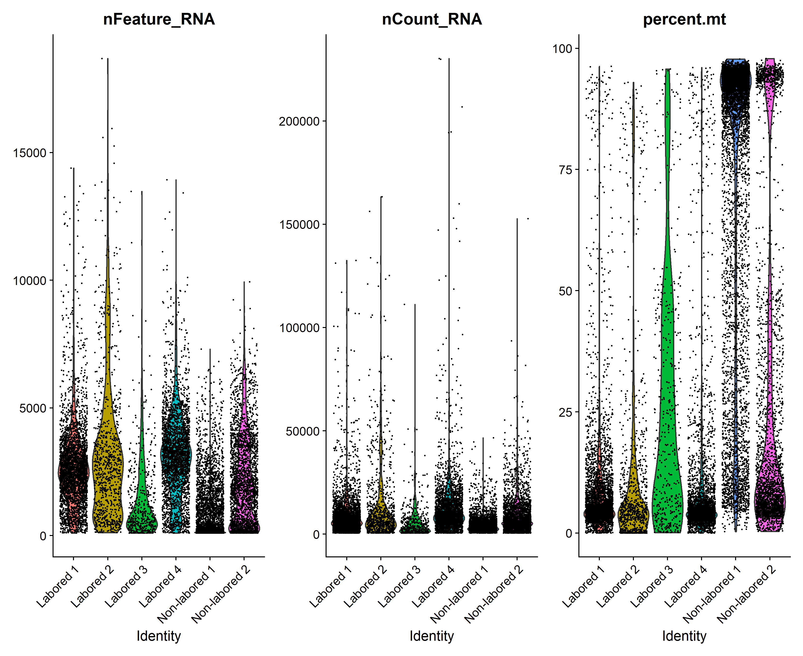

``` r
placenta <- subset(placenta, subset = nFeature_RNA > 200 & nFeature_RNA < 10000 & percent.mt < 25)
p2 <- VlnPlot(placenta, features = c('nFeature_RNA', 'nCount_RNA', 'percent.mt'), group.by = 'orig.ident')
p2
```

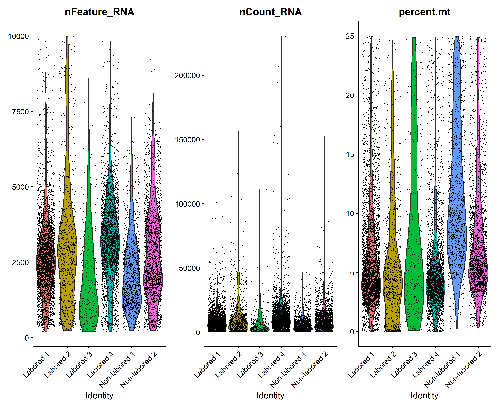

## Processing Data

``` r
placenta <- NormalizeData(placenta, normalization.method = 'LogNormalize', scale.factor = 10000)
placenta <- FindVariableFeatures(placenta, selection.method = 'vst', nfeatures = 2000)
top10 <- head(VariableFeatures(placenta), 10)
LabelPoints(plot = VariableFeaturePlot(placenta), points = top10, repel = T)
```

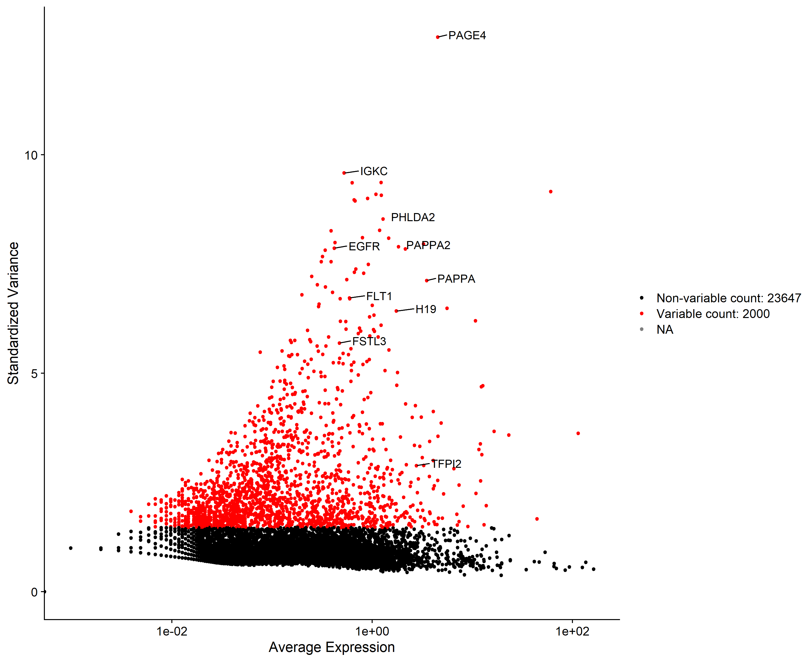

``` r
#Scaling the data
all.genes <- rownames(placenta)
placenta <- ScaleData(placenta, features = all.genes)

#Perform Linear reduction
placenta <- RunPCA(placenta, features = VariableFeatures(object = placenta))
```

## Choosing dimensions for data reduction

``` r
p3 <- ElbowPlot(placenta)
p3
```

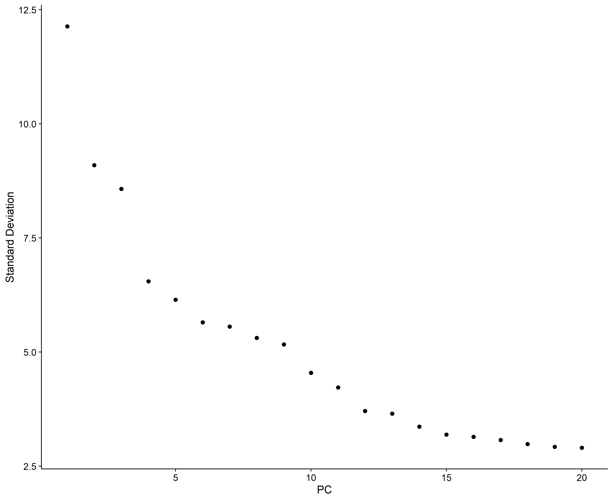

``` r
p4 <- DimHeatmap(placenta, dims = 1:20, cells = 500) 
```

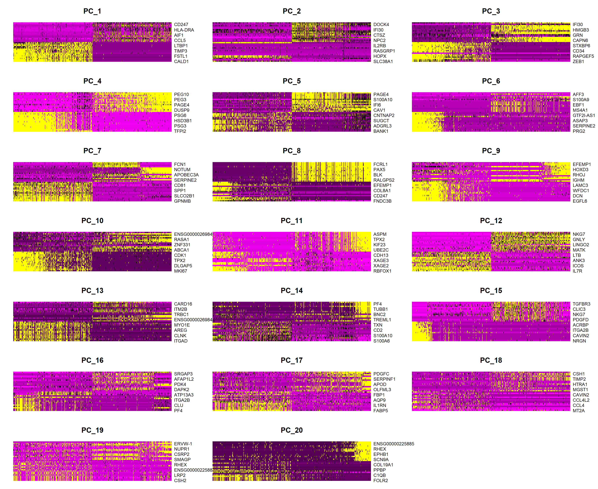

``` r
p4
```

    ## NULL

## Performing Dimentionality Reduction

``` r
placenta <- FindNeighbors(placenta, dims = 1:15)
placenta <- FindClusters(placenta, resolution = 1, cluster.name = 'unintegrated clusters')
```

    ## Modularity Optimizer version 1.3.0 by Ludo Waltman and Nees Jan van Eck
    ## 
    ## Number of nodes: 9767
    ## Number of edges: 322557
    ## 
    ## Running Louvain algorithm...
    ## Maximum modularity in 10 random starts: 0.8967
    ## Number of communities: 28
    ## Elapsed time: 0 seconds

``` r
placenta <- RunUMAP(placenta, dims = 1:15)
```

## Integrating the data

``` r
#Integrating Layers
placenta <- IntegrateLayers(placenta, method = CCAIntegration, orig.reduction = 'pca', new.reduction = 'integrated.cca')
placenta[['RNA']] <- JoinLayers(placenta[['RNA']])

#'[MAKE SURE THAT YOU USE INTEGRATED.CCA AS YOUR REDUCTION METHODS FROM NOW ON!!!]
placenta <- FindNeighbors(placenta, reduction = "integrated.cca", dims = 1:15)
placenta <- FindClusters(placenta, resolution = 1, cluster.name = "cca_clusters")
```

    ## Modularity Optimizer version 1.3.0 by Ludo Waltman and Nees Jan van Eck
    ## 
    ## Number of nodes: 9767
    ## Number of edges: 346340
    ## 
    ## Running Louvain algorithm...
    ## Maximum modularity in 10 random starts: 0.8991
    ## Number of communities: 28
    ## Elapsed time: 0 seconds

``` r
#Making the UMAP for integrated layers
placenta <- RunUMAP(placenta, reduction = 'integrated.cca', dims = 1:15, reduction.name = 'umap.cca')
```

## Comparing data pre and post integration

``` r
p5 <- DimPlot(placenta, reduction = 'umap.cca', label = T) + NoLegend() + ggtitle('Integrated UMAP')
p6 <- DimPlot(placenta, reduction = 'umap.cca', group.by = 'orig.ident', shuffle = T) + ggtitle('Integrated UMAP')
p7 <- DimPlot(placenta, reduction = 'umap', label = T) + NoLegend() + ggtitle('Unintegrated UMAP')
p8 <- DimPlot(placenta, reduction = 'umap', group.by = 'orig.ident', shuffle = T) + ggtitle('Unintegrated UMAP')
p5 + p6 + p7 + p8
```

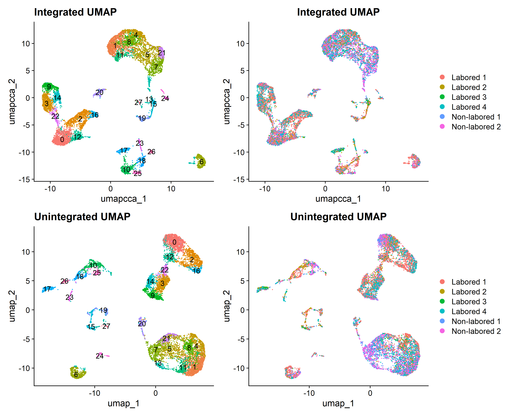

``` r
#Seeing cluster contribution by sample
p9 <- DimPlot(placenta, reduction = 'umap.cca', split.by = 'orig.ident')
p9
```

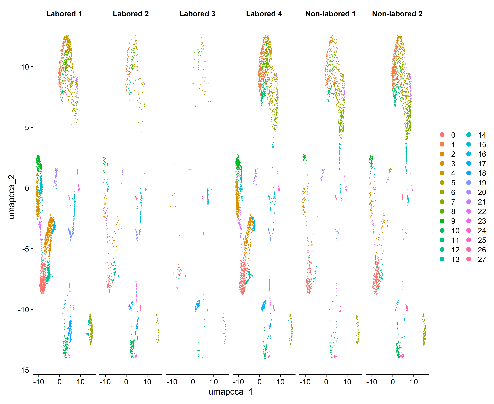

``` r
p10 <- DimPlot(placenta, reduction = 'umap', split.by = 'orig.ident')
p10
```

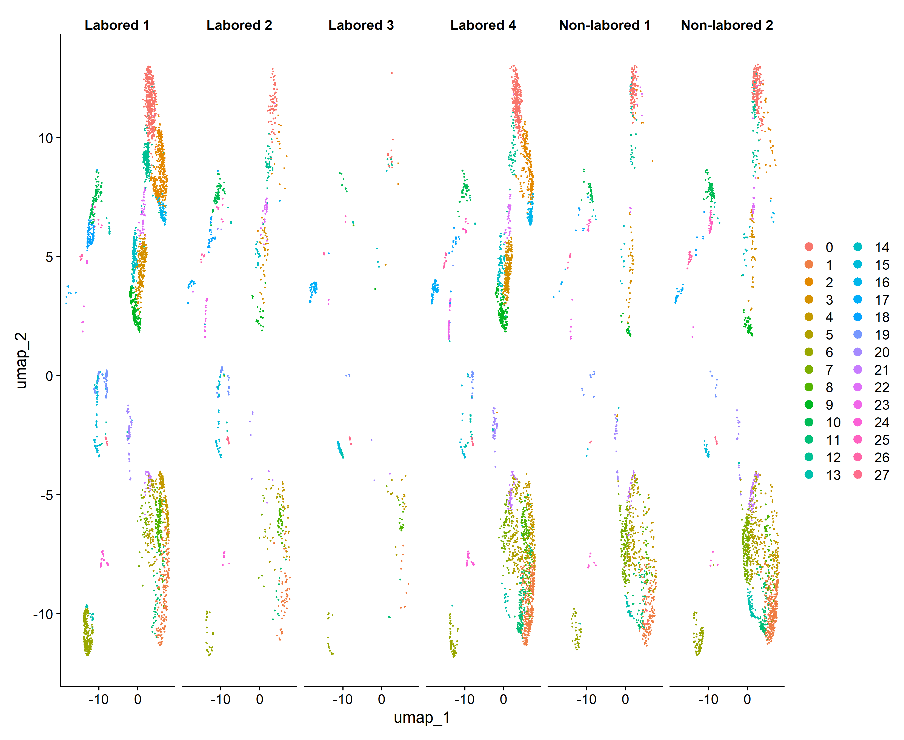

## Cluster Identification

``` r
FeaturePlot(placenta, features = c('PTPRC', 'EOMES', 'NCR1', 'CD3D', 'CD3G'), reduction = 'umap.cca')
```

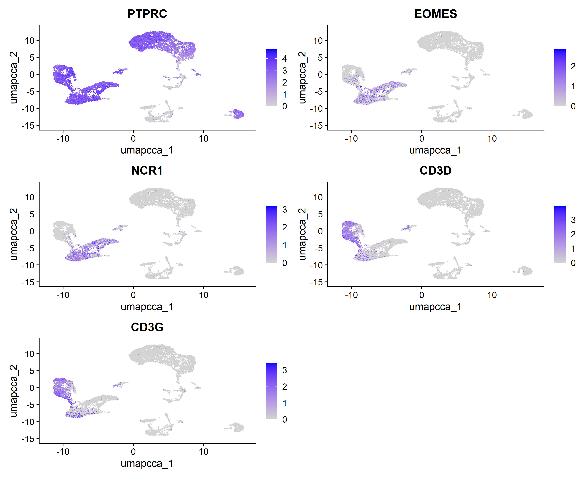

``` r
FeaturePlot(placenta, features = c('CD86', 'HLA-DRA', 'ITGAM', 'GP9', 'ITGB3'), reduction = 'umap.cca')
```

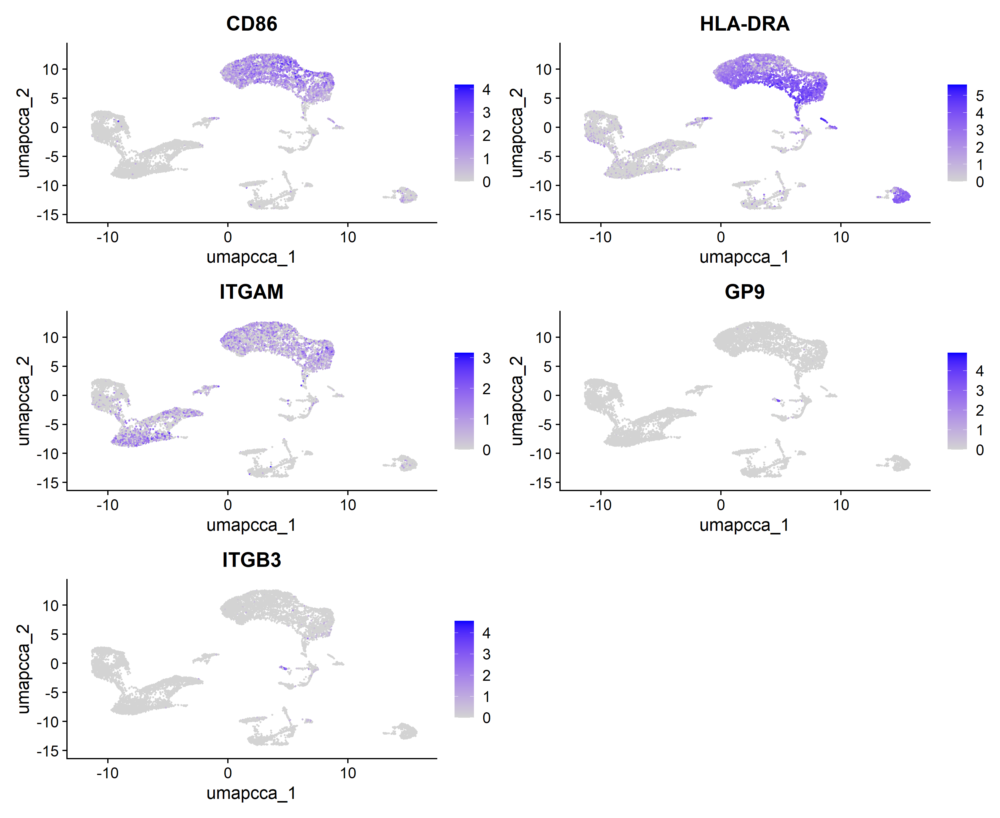

``` r
FeaturePlot(placenta, features = c('PECAM1', 'DCN', 'HLA-G', 'ITGA6', 'OVOL1'), reduction = 'umap.cca')
```

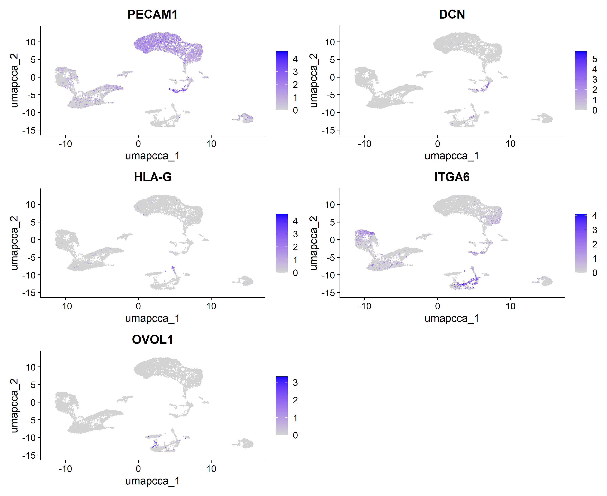

``` r
FeaturePlot(placenta, features = c('TP63', 'LPCAT1', 'MKI67', 'SPRYY1', 'VEGFA'), reduction = 'umap.cca')
```

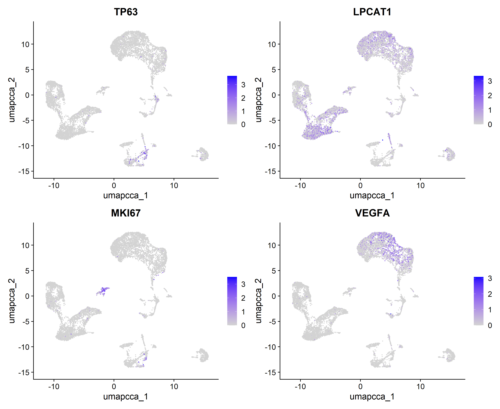

\#Cluster Labelling

``` r
#Labeling clusters
placenta <- RenameIdents(object = placenta,
                         '0' = 'NK Cells',
                         '1' = 'Macrophages',
                         '2' = 'NK Cells',
                         '3' = 'T Cells',
                         '4' = 'Dendritic Cells',
                         '5' = 'Macrophages',
                         '6' = 'B Cells',
                         '7' = 'Macrophages',
                         '8' = 'Hofbauer Cells',
                         '9' = 'T Cells',
                         '10' = 'pCTs',
                         '11' = 'Macrophages',
                         '12' = 'NK Cells', 
                         '13' = 'Macrophages',
                         '14' = 'T Cells',
                         '15' = 'Stromal Cells', 
                         '16' = 'NK Cells',
                         '17' = 'Fus. Comp. CTs', 
                         '18' = 'Prolif. CTs/CCCs',
                         '19' = 'ECs',
                         '20' = 'Activated T Cells',
                         '21' = 'Macrophages',
                         '22' = 'T Cells',
                         '23' = 'EVTs', 
                         '24' = 'Macrophages', 
                         '25' = 'Prolif. CTs/CCCs',
                         '26' = 'Early ST', 
                         '27' = 'Megakaryocytes')
placenta$cluster.ident <- Idents(placenta)

#DotPlot
palette.go <- colorRampPalette(c('#3a93c3', '#d1e5f0', '#fedbc7', '#f6a582'))
DotPlot_scCustom(placenta, dot.scale = 10, features = c('ITGA6', 'GATA3', 'TP63','MKI67','ERVW-1', 'PSG8', 
                                                        'HLA-G', 'SPRY1', 'LPCAT1', 'PECAM1', 'DCN', 'PTPRC', 'CD86', 
                                                        'HLA-DRA', 'ITGAX', 'EOMES', 'MS4A1', 'CD3D', 'CD3G', 'GP9','ITGB3'),
                 assay = 'RNA', remove_axis_titles = T, colors_use = palette.go(4)) + theme(axis.text.x = 
                                                                                              element_text(angle = 45, face = 'italic', vjust = 1, hjust = 1, size = 20), axis.text.y = element_text(angle = 0, hjust = 0.5, size = 20))
```

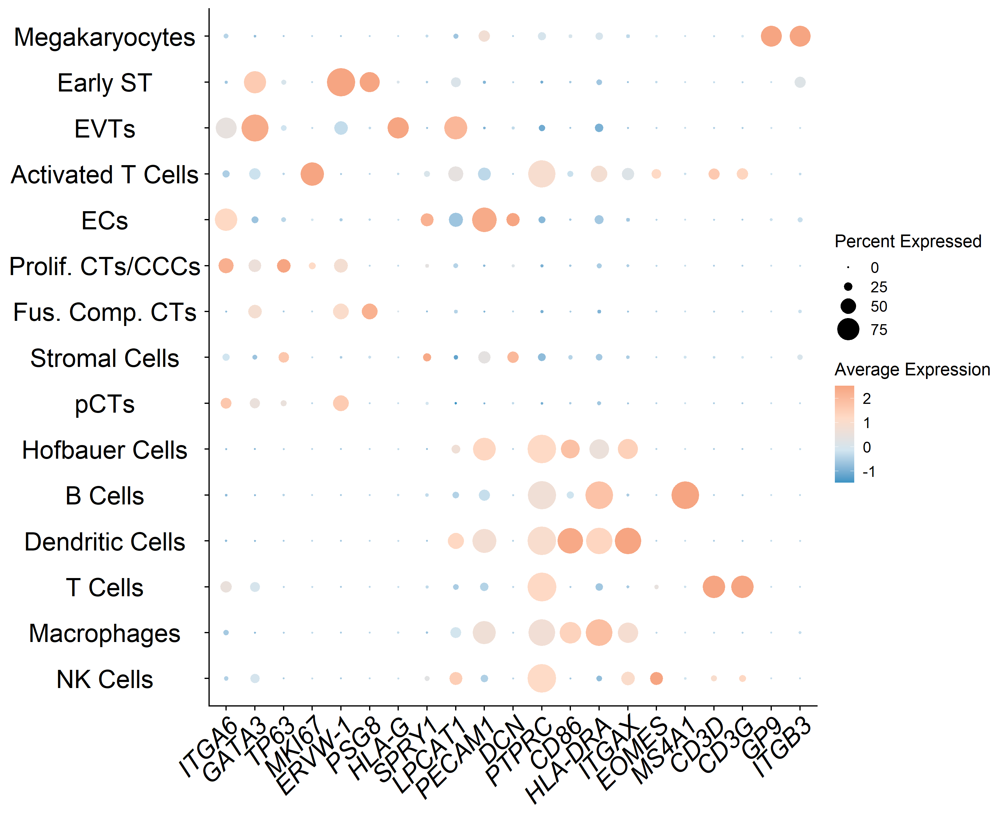

``` r
p5 <- DimPlot(placenta, reduction = 'umap.cca') + ggtitle('Integrated UMAP') + theme(legend.text = element_text(size = 10))
p6 <- DimPlot(placenta, reduction = 'umap.cca', group.by = 'orig.ident', shuffle = T) + ggtitle('Integrated UMAP')
p7 <- DimPlot(placenta, reduction = 'umap') + ggtitle('Unintegrated UMAP') + theme(legend.text = element_text(size = 10))
p8 <- DimPlot(placenta, reduction = 'umap', group.by = 'orig.ident', shuffle = T) + ggtitle('Unintegrated UMAP')
p5 + p6 
```

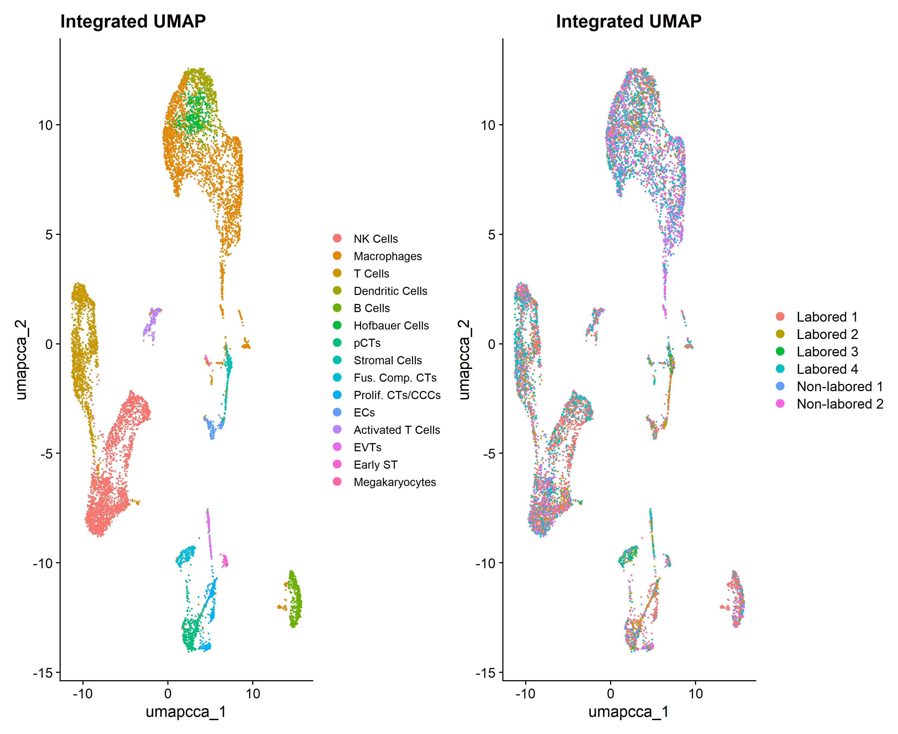

``` r
p7 + p8
```

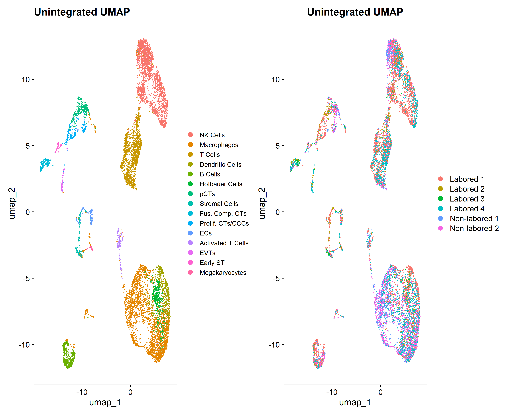

# Workflow for the membrane sc dataset

## Creating Seurat Objects

``` r
#Creating Seurat Objects
mem_25_6 <- CreateSeuratObject(counts = mem_25_6.data, project = 'Non-labored 1', min.cells = 3, min.features = 100)
mem_25_7 <- CreateSeuratObject(counts = mem_25_7.data, project = 'Non-labored 2', min.cells = 3, min.features = 100)
mem_020325 <- CreateSeuratObject(counts = mem_020325.data, project = 'Labored 1', min.cells = 3, min.features = 100)
mem_021125 <- CreateSeuratObject(counts = mem_021125.data, project = 'Labored 2', min.cells = 3, min.features = 100)
mem_022025 <- CreateSeuratObject(counts = mem_022025.data, project = 'Labored 3', min.cells = 3, min.features = 100)
mem_052725 <- CreateSeuratObject(counts = mem_052725.data, project = 'Labored 4', min.cells = 3, min.features = 100)

#Merging objects
membrane <- merge(x = mem_25_6, y = c(mem_25_7, mem_020325, mem_021125, mem_022025, mem_052725))
```

## Filtering the datasets

``` r
#Filtering the data
membrane[['percent.mt']] <- PercentageFeatureSet(membrane, pattern = '^MT-')
p1 <- VlnPlot(membrane, features = c('nFeature_RNA', 'nCount_RNA', 'percent.mt'))
p1
```

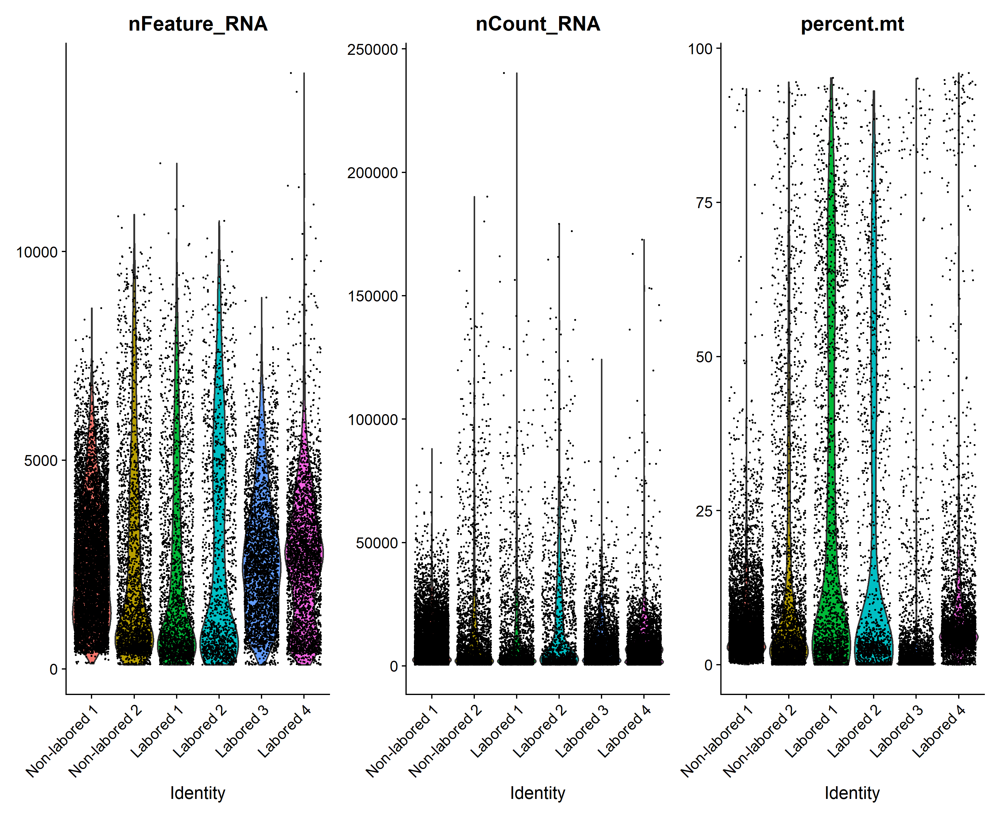

``` r
membrane <- subset(membrane, subset = nFeature_RNA > 200 & nFeature_RNA < 10000 & percent.mt < 25)
p2 <- VlnPlot(membrane, features = c('nFeature_RNA', 'nCount_RNA', 'percent.mt'))
p2
```

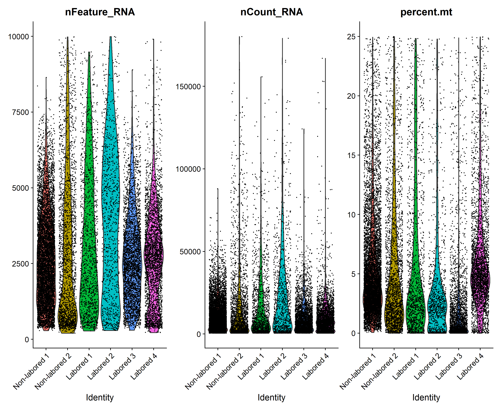

## Processing the data

``` r
#Pre-processing
membrane <- NormalizeData(membrane, normalization.method = 'LogNormalize', scale.factor = 10000)
membrane <- FindVariableFeatures(membrane, selection.method = 'vst', nfeatures = 2000)
top10 <- head(VariableFeatures(membrane), 10)
p3 <- LabelPoints(plot = VariableFeaturePlot(membrane), points = top10, repel = T)
p3
```

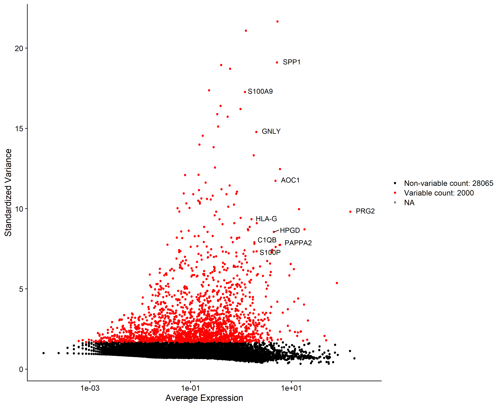

``` r
#Scaling the data
all.genes <- rownames(membrane)
membrane <- ScaleData(membrane, features = all.genes)

#PCA
membrane <- RunPCA(membrane, features = VariableFeatures(object = membrane))
p4 <- ElbowPlot(membrane)
p4
```

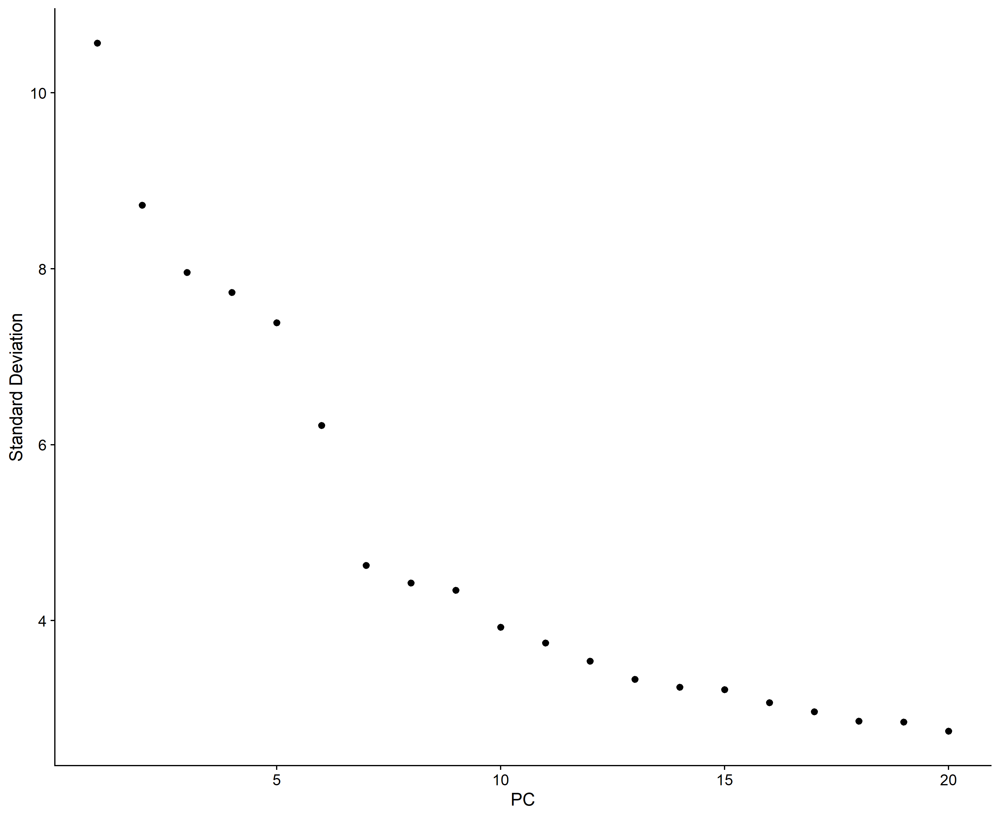

``` r
#Making the UMAP
membrane <- FindNeighbors(membrane, dims = 1:15)
membrane <- FindClusters(membrane, resolution = 1)
```

    ## Modularity Optimizer version 1.3.0 by Ludo Waltman and Nees Jan van Eck
    ## 
    ## Number of nodes: 19671
    ## Number of edges: 636889
    ## 
    ## Running Louvain algorithm...
    ## Maximum modularity in 10 random starts: 0.9180
    ## Number of communities: 31
    ## Elapsed time: 1 seconds

``` r
membrane <- RunUMAP(membrane, dims = 1:15)
membrane
```

    ## An object of class Seurat 
    ## 32310 features across 19671 samples within 1 assay 
    ## Active assay: RNA (32310 features, 2000 variable features)
    ##  13 layers present: counts.Non-labored 1, counts.Non-labored 2, counts.Labored 1, counts.Labored 2, counts.Labored 3, counts.Labored 4, data.Non-labored 1, data.Non-labored 2, data.Labored 1, data.Labored 2, data.Labored 3, data.Labored 4, scale.data
    ##  2 dimensional reductions calculated: pca, umap

## Integrating the data

``` r
#Integrating Layers
membrane <- IntegrateLayers(membrane, method = CCAIntegration, orig.reduction = 'pca', new.reduction = 'integrated.cca')

#'[MAKE SURE THAT YOU USE INTEGRATED.CCA AS YOUR REDUCTION METHODS FROM NOW ON!!!]
membrane <- FindNeighbors(membrane, reduction = "integrated.cca", dims = 1:15)
membrane <- FindClusters(membrane, resolution = 1, cluster.name = "cca_clusters")
```

    ## Modularity Optimizer version 1.3.0 by Ludo Waltman and Nees Jan van Eck
    ## 
    ## Number of nodes: 19671
    ## Number of edges: 681654
    ## 
    ## Running Louvain algorithm...
    ## Maximum modularity in 10 random starts: 0.9086
    ## Number of communities: 32
    ## Elapsed time: 1 seconds

``` r
#Making the UMAp for integrated layers
membrane <- RunUMAP(membrane, reduction = 'integrated.cca', dims = 1:15, reduction.name = 'umap.cca')
#Joining layers
membrane[['RNA']] <- JoinLayers(membrane[['RNA']])
```

## Checking integration

``` r
p5 <- DimPlot(membrane, reduction = 'umap.cca', label = T) + NoLegend() + ggtitle('Integrated UMAP')
p6 <- DimPlot(membrane, reduction = 'umap.cca', group.by = 'orig.ident', shuffle = T) + ggtitle('Integrated UMAP')
p7 <- DimPlot(membrane, reduction = 'umap', label = T) + NoLegend() + ggtitle('Unintegrated UMAP')
p8 <- DimPlot(membrane, reduction = 'umap', group.by = 'orig.ident', shuffle = T) + ggtitle('Unintegrated UMAP')
p5 + p6 + p7 + p8
```

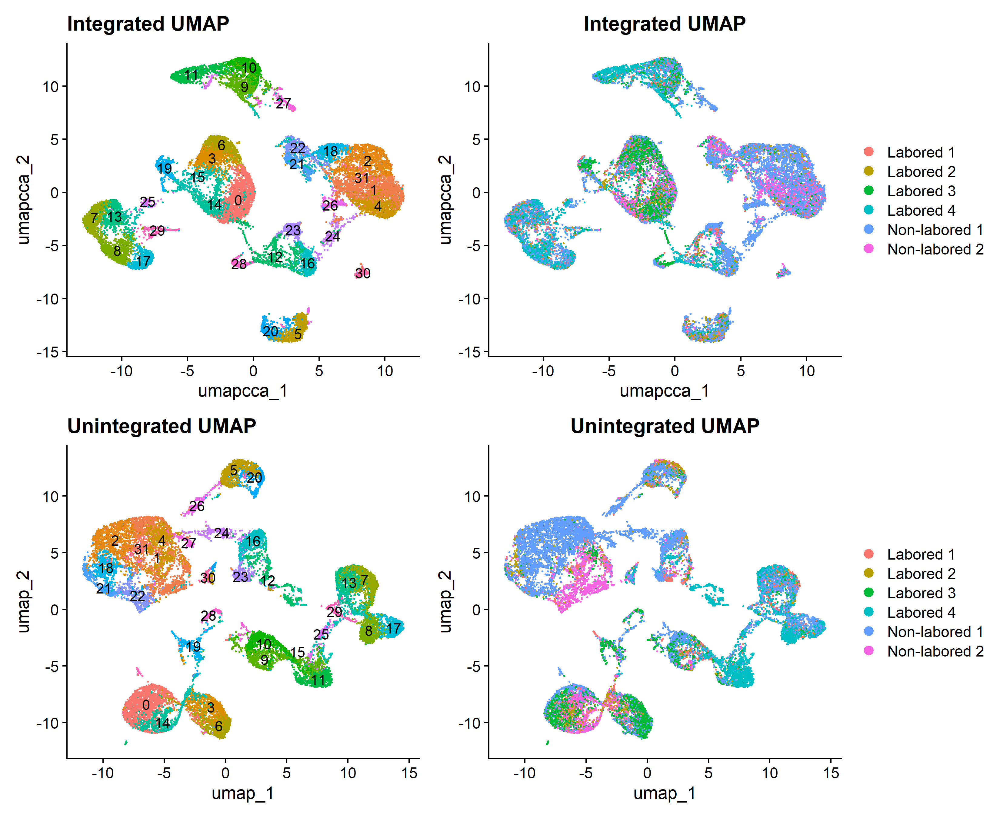

## Seeing cluster contribution by sample

``` r
p9 <- DimPlot(membrane, reduction = 'umap.cca', split.by = 'orig.ident')
p9
```

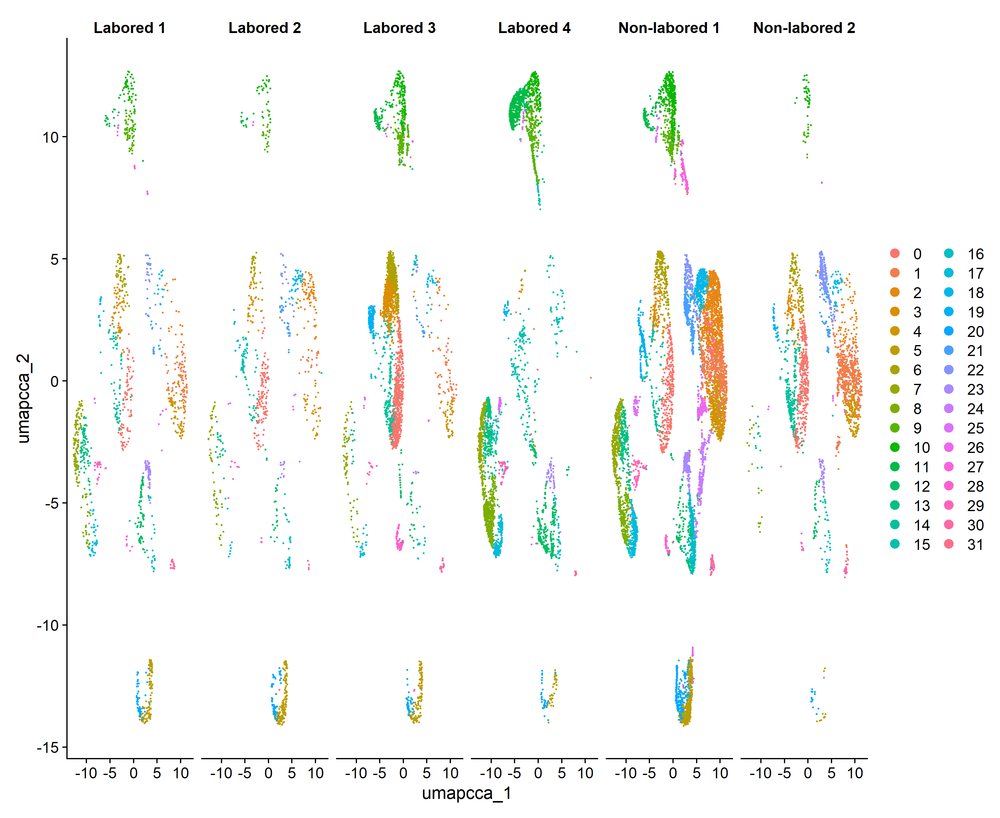

``` r
p10 <- DimPlot(membrane, reduction = 'umap', split.by = 'orig.ident')
p10
```

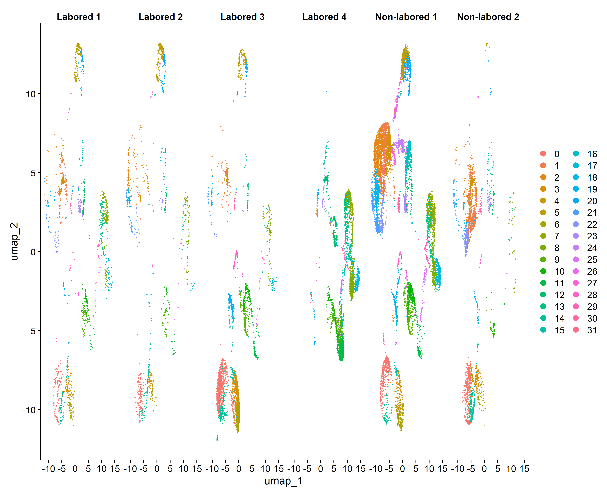

## Cluster identification

``` r
#Identifying cell markers
FeaturePlot(membrane, features = c('PTPRC', 'CD3D', 'CD3G', 'CD86', 'ITGAM', 'HLA-DRA', 'MKI67'), reduction = 'umap.cca')
```

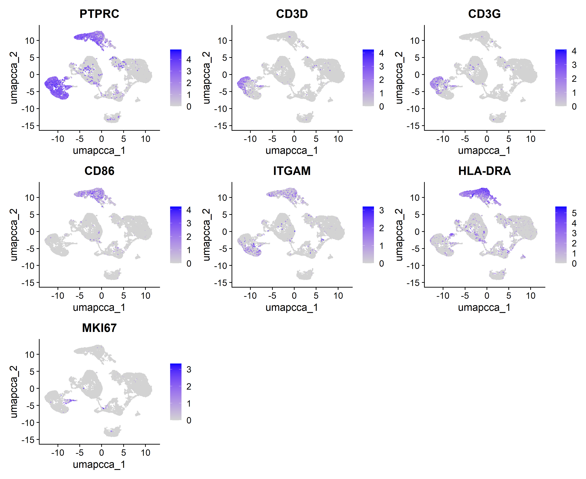

``` r
FeaturePlot(membrane, features = c('PTPRC', 'MS4A1', 'MKI67', 'NCAM1', 'EOMES', 'ITGAX'), reduction = 'umap.cca')
```

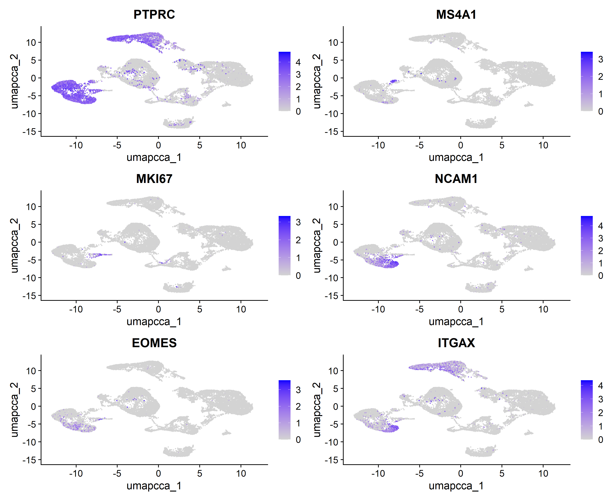

``` r
FeaturePlot(membrane, features = c('HLA-G', 'KRT7', 'VIM', 'PECAM1', 'LYVE1', 'PROX1'), reduction = 'umap.cca')
```

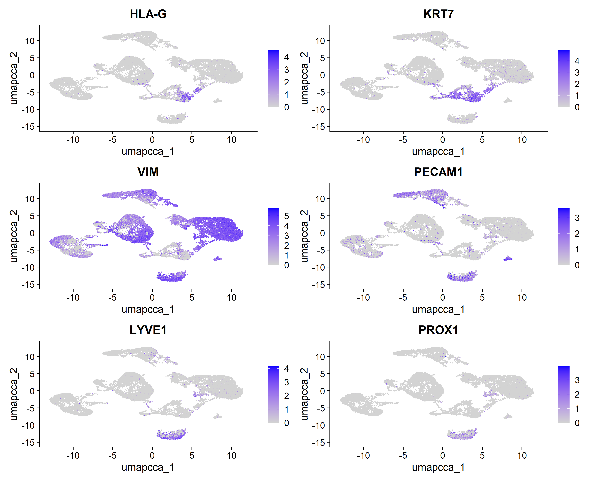

``` r
FeaturePlot(membrane, features = c('PRL', 'IGFBP1', 'DCN', 'IGF1', 'PGR', 'HAND2'), reduction = 'umap.cca')
```

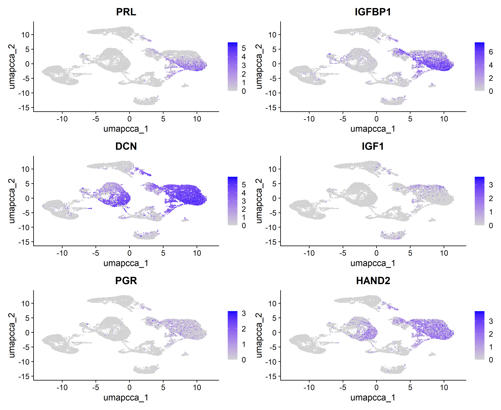

``` r
FeaturePlot(membrane, features = c('CSH1', 'CSH2', 'GATA3', 'KRT7', 'KRT19', 'HLA-G', 'CDH1'), reduction = 'umap.cca')
```

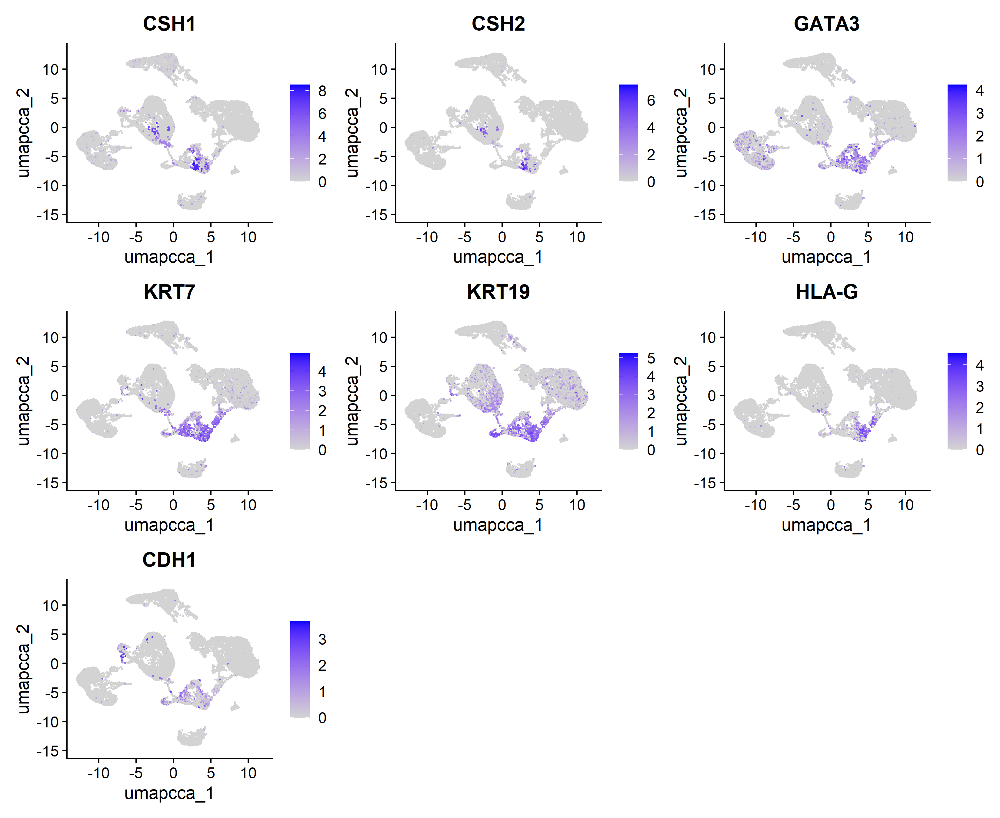

``` r
FeaturePlot(membrane, features = c('PDGFRB', 'ENG', 'NT5E', 'THY1', 'CD34', 'ACTA2'), reduction = 'umap.cca')
```

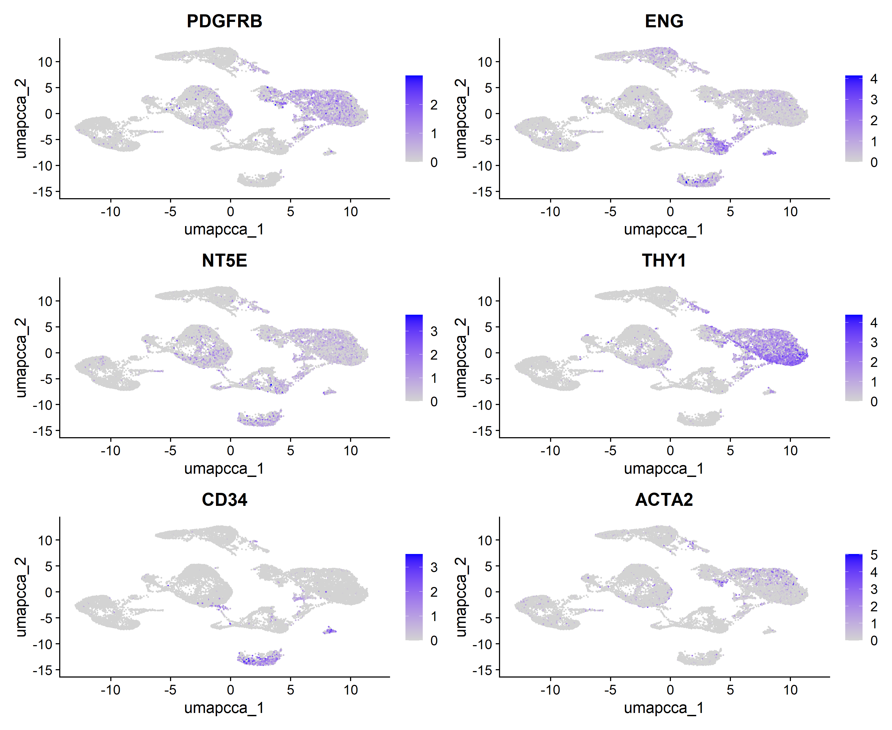

## Cluster labeling

``` r
membrane <- RenameIdents(object = membrane,
                         '0' = 'Stromal 1',
                         '1' = 'Decidualized Cells',
                         '2' = 'Decidualizing Cells',
                         '3' = 'Stromal 2',
                         '4' = 'Decidualized Cells',
                         '5' = 'Lymphatic ECs',
                         '6' = 'Stromal 3',
                         '7' = 'T Cells',
                         '8' = 'NK Cells',
                         '9' = 'Macrophages',
                         '10' = 'Macrophages',
                         '11' = 'Macrophages',
                         '12' = 'Amniotic Epithelial Cells', 
                         '13' = 'T Cells',
                         '14' = 'Stromal 4',
                         '15' = 'Stromal 5', 
                         '16' = 'Chorionic Trophoblast Cells',
                         '17' = 'NK Cells', 
                         '18' = 'Decidualizing Cells',
                         '19' = 'Unknown',
                         '20' = 'Lymphatic ECs',
                         '21' = 'Pericytes',
                         '22' = 'Stromal 6',
                         '23' = 'Chorionic Trophoblast Cells', 
                         '24' = 'Chorionic Epithelial Cells', 
                         '25' = 'B Cells',
                         '26' = 'Decidualized Cells', 
                         '27' = 'Macrophages',
                         '28' = 'Amniotic Epithelial Cells',
                         '29' = 'Activated T Cells', 
                         '30' = 'ECs',
                         '31' = 'Decidualizing Cells')
membrane$cluster.ident <- Idents(membrane)

#Checking the labeling
DotPlot_scCustom(membrane, dot.scale = 7, features = c('DCN', 'PRL', 'IGFBP1','IGF1','PGR','HLA-G', 'KRT7', 
                                                       'KRT19','VIM', 'CSH1', 'GATA3', 'CDH1', 'PECAM1', 'PROX1',
                                                       'LYVE1', 'PDGFRB', 'PTPRC', 'CD3D', 'MKI67', 'CD86', 
                                                       'NCAM1', 'MS4A1', 'HLA-DRA'),
                 assay = 'RNA', remove_axis_titles = T, colors_use = palette.go(4)) + theme(axis.text.x = 
                                                    element_text(angle = 45, face = 'italic', vjust = 1, hjust = 1, size = 20),
                                                       axis.text.y = element_text(angle = 0, hjust = 0.5, size = 20))
```

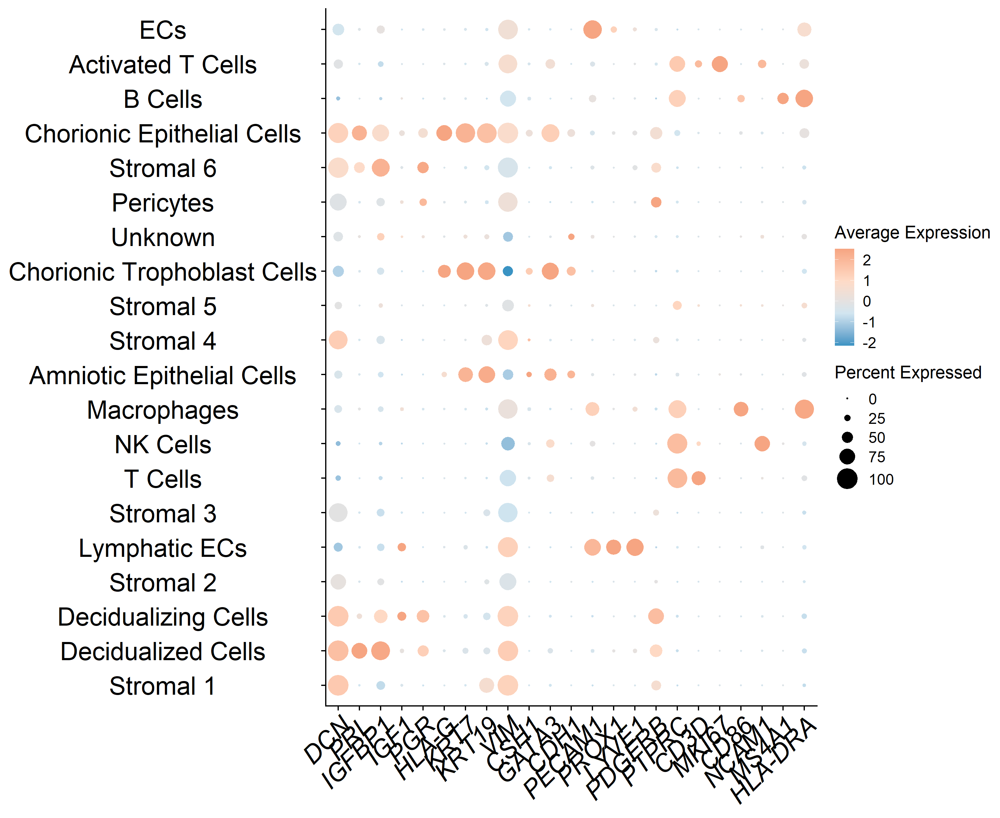

## UMAP with integrated labels

``` r
p5 <- DimPlot(membrane, reduction = 'umap.cca') + ggtitle('Integrated UMAP') + theme(legend.text = element_text(size = 10))
p6 <- DimPlot(membrane, reduction = 'umap.cca', group.by = 'orig.ident', shuffle = T) + ggtitle('Integrated UMAP')
p7 <- DimPlot(membrane, reduction = 'umap') + ggtitle('Unintegrated UMAP') + theme(legend.text = element_text(size = 10))
p8 <- DimPlot(membrane, reduction = 'umap', group.by = 'orig.ident', shuffle = T) + ggtitle('Unintegrated UMAP')
p5
```

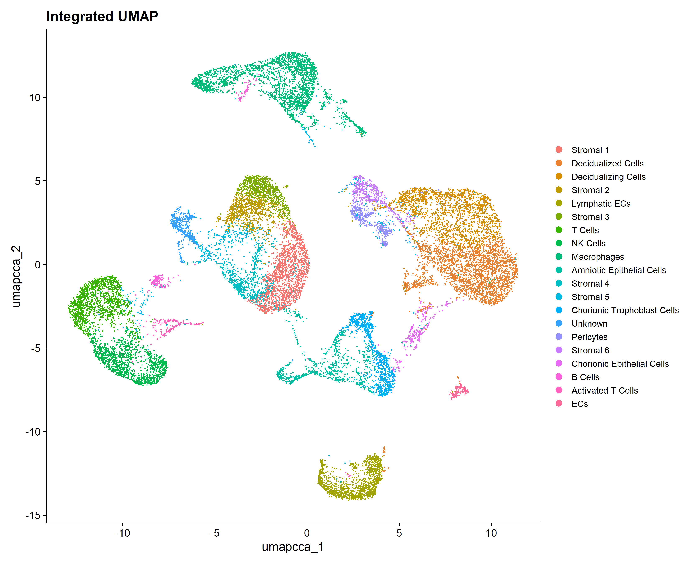

``` r
p6
```

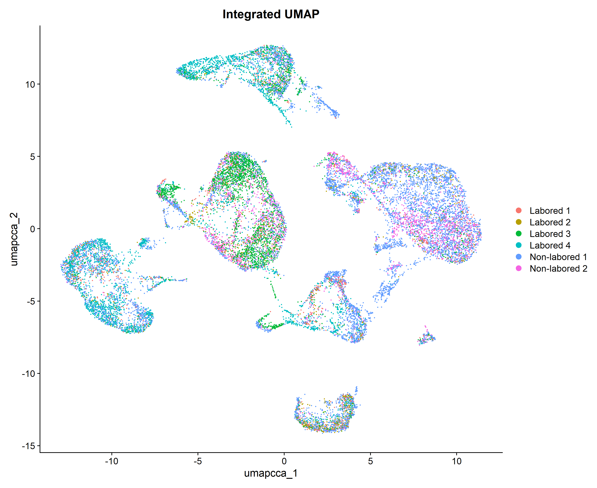

``` r
p7
```

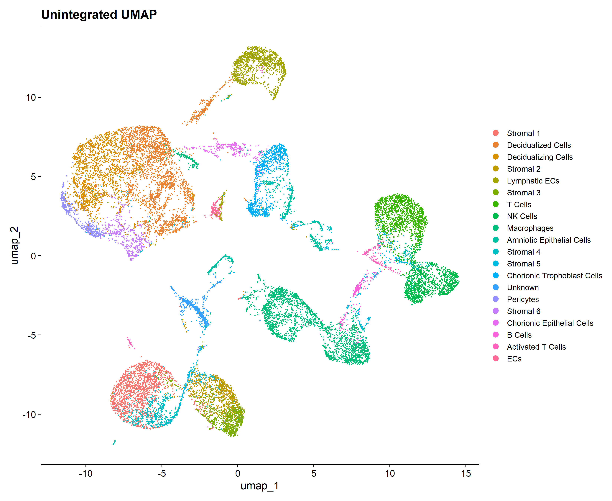

``` r
p8
```

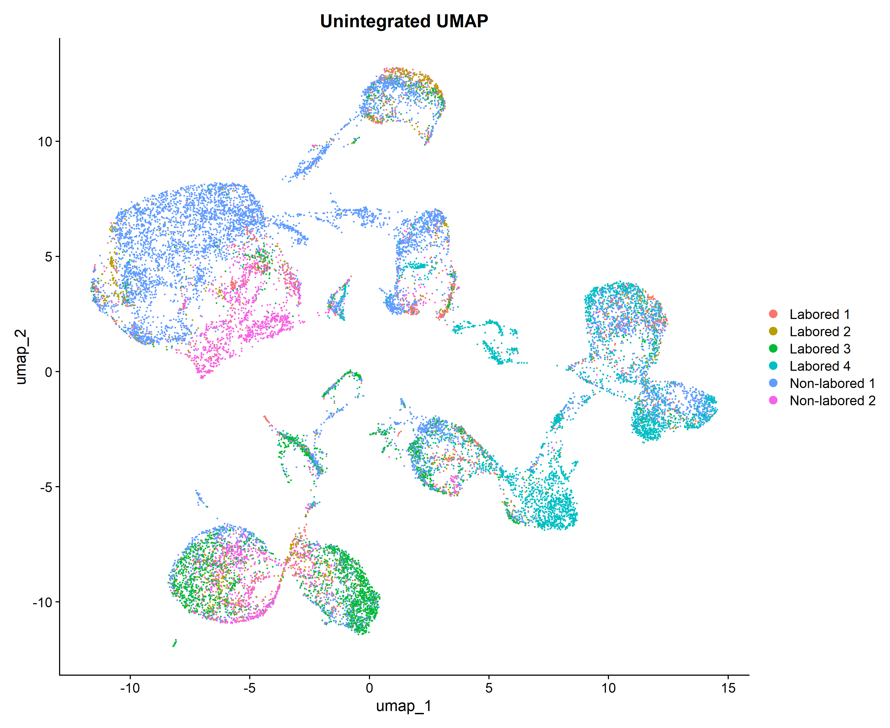

# Workflow for the myometrim sc dataset

## Creating the Seurat dataset

``` r
#Creating Seurat Objects
myo_25_6_1 <- CreateSeuratObject(counts = myo_25_6_1.data, project = 'Non-labored 1', min.cells = 3, min.features = 100)
myo_25_6_2 <- CreateSeuratObject(counts = myo_25_6_2.data, project = 'Non-labored 1', min.cells = 3, min.features = 100)
myo_25_7 <- CreateSeuratObject(counts = myo_25_7.data, project = 'Non-labored 2', min.cells = 3, min.features = 100)

#Merging objects
myometrium <- merge(x = myo_25_6_1, y = c(myo_25_6_2, myo_25_7))
```

## Filtering the datasets

``` r
#Filtering the data
myometrium[['percent.mt']] <- PercentageFeatureSet(myometrium, pattern = '^MT-')
p1 <- VlnPlot(myometrium, features = c('nFeature_RNA', 'nCount_RNA', 'percent.mt'))
p1
```

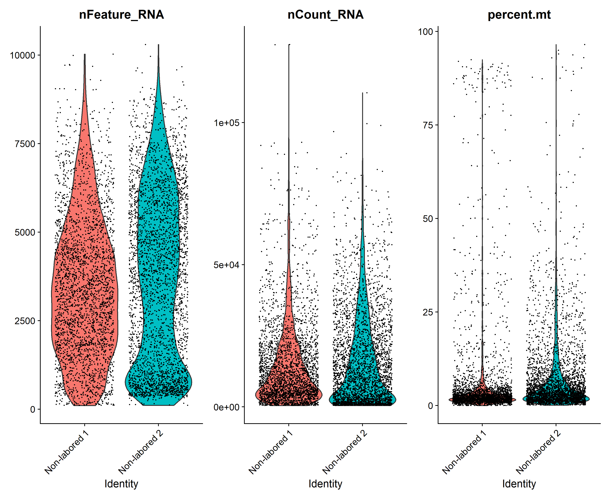

``` r
myometrium <- subset(myometrium, subset = nFeature_RNA > 200 & nFeature_RNA < 10000 & percent.mt < 30)
p2 <- VlnPlot(myometrium, features = c('nFeature_RNA', 'nCount_RNA', 'percent.mt'))
p2
```

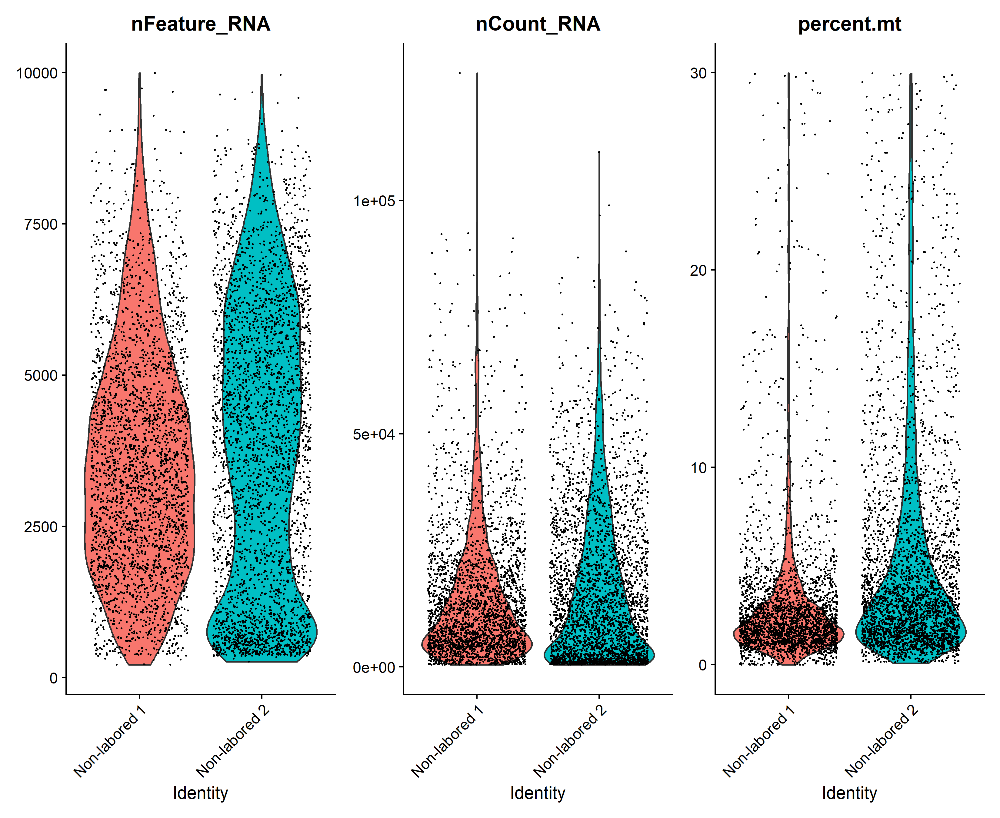

## Processing the data

``` r
#Pre-processing
myometrium <- NormalizeData(myometrium, normalization.method = 'LogNormalize', scale.factor = 10000)
myometrium <- FindVariableFeatures(myometrium, selection.method = 'vst', nfeatures = 2000)
top10 <- head(VariableFeatures(myometrium), 10)
p3 <- LabelPoints(plot = VariableFeaturePlot(myometrium), points = top10, repel = T)
p3
```

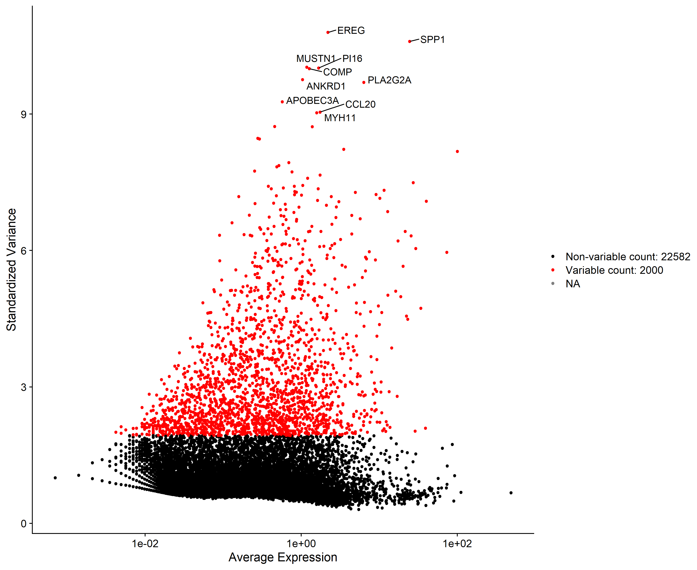

``` r
#Scaling the data
all.genes <- rownames(myometrium)
myometrium <- ScaleData(myometrium, features = all.genes)

#PCA
myometrium <- RunPCA(myometrium, features = VariableFeatures(object = myometrium))
p4 <- ElbowPlot(myometrium)
p4
```

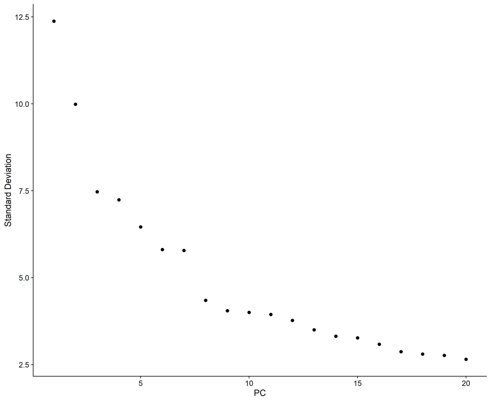

``` r
#Making the UMAP
myometrium <- FindNeighbors(myometrium, dims = 1:15)
myometrium <- FindClusters(myometrium, resolution = 1)
```

    ## Modularity Optimizer version 1.3.0 by Ludo Waltman and Nees Jan van Eck
    ## 
    ## Number of nodes: 6125
    ## Number of edges: 180038
    ## 
    ## Running Louvain algorithm...
    ## Maximum modularity in 10 random starts: 0.9051
    ## Number of communities: 23
    ## Elapsed time: 0 seconds

``` r
myometrium <- RunUMAP(myometrium, dims = 1:15)
```

## Integrating the data

``` r
#Integrating Layers
myometrium <- IntegrateLayers(myometrium, method = CCAIntegration, orig.reduction = 'pca', new.reduction = 'integrated.cca')
myometrium[['RNA']] <- JoinLayers(myometrium[['RNA']])

#'[MAKE SURE THAT YOU USE INTEGRATED.CCA AS YOUR REDUCTION METHODS FROM NOW ON!!!]
myometrium <- FindNeighbors(myometrium, reduction = "integrated.cca", dims = 1:15)
myometrium <- FindClusters(myometrium, resolution = 1, cluster.name = "cca_clusters")
```

    ## Modularity Optimizer version 1.3.0 by Ludo Waltman and Nees Jan van Eck
    ## 
    ## Number of nodes: 6125
    ## Number of edges: 185553
    ## 
    ## Running Louvain algorithm...
    ## Maximum modularity in 10 random starts: 0.9005
    ## Number of communities: 25
    ## Elapsed time: 0 seconds

``` r
#Making the UMAp for integrated layers
myometrium <- RunUMAP(myometrium, reduction = 'integrated.cca', dims = 1:15, reduction.name = 'umap.cca')
```

## Checking integration

``` r
p5 <- DimPlot(myometrium, reduction = 'umap.cca', label = T) + NoLegend() + ggtitle('Integrated UMAP')
p6 <- DimPlot(myometrium, reduction = 'umap.cca', group.by = 'orig.ident', shuffle = T) + ggtitle('Integrated UMAP')
p7 <- DimPlot(myometrium, reduction = 'umap', label = T) + NoLegend() + ggtitle('Unintegrated UMAP')
p8 <- DimPlot(myometrium, reduction = 'umap', group.by = 'orig.ident', shuffle = T) + ggtitle('Unintegrated UMAP')
p5 + p6 + p7 + p8
```

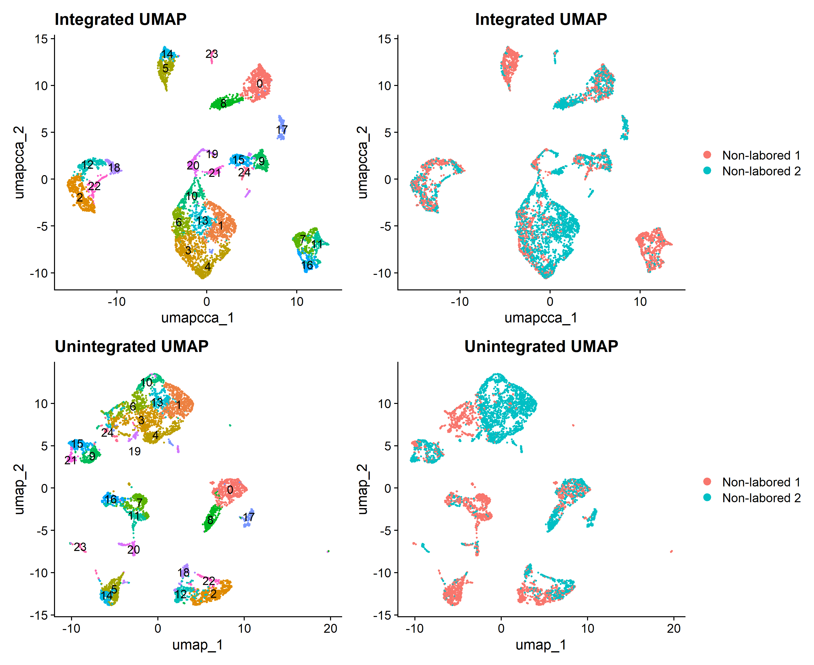

\#Seeing cluster contribution by sample

``` r
p9 <- DimPlot(myometrium, reduction = 'umap.cca', split.by = 'orig.ident')
p9
```

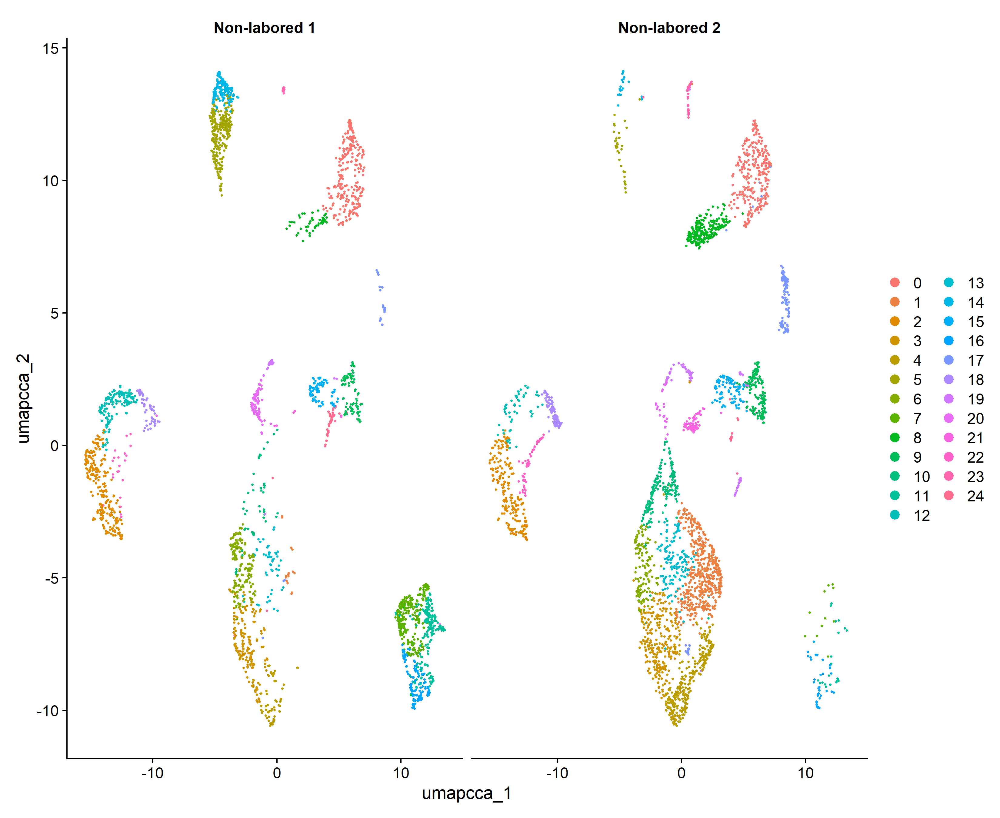

``` r
p10 <- DimPlot(myometrium, reduction = 'umap', split.by = 'orig.ident')
p10
```

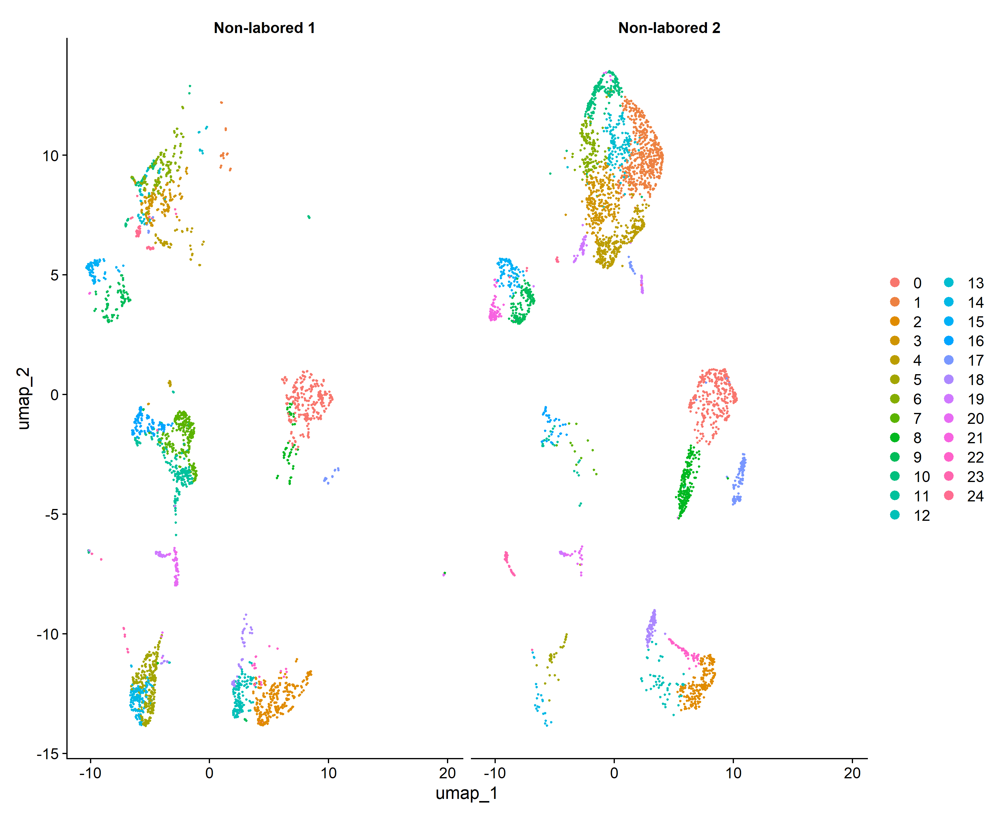

## Cluster identification

``` r
#Identifying cell markers
FeaturePlot(myometrium, features = c('PTPRC', 'CD3D', 'CD3G', 'CD86', 'HLA-DRA', 'MS4A1', 'CD19'), reduction = 'umap.cca')
```

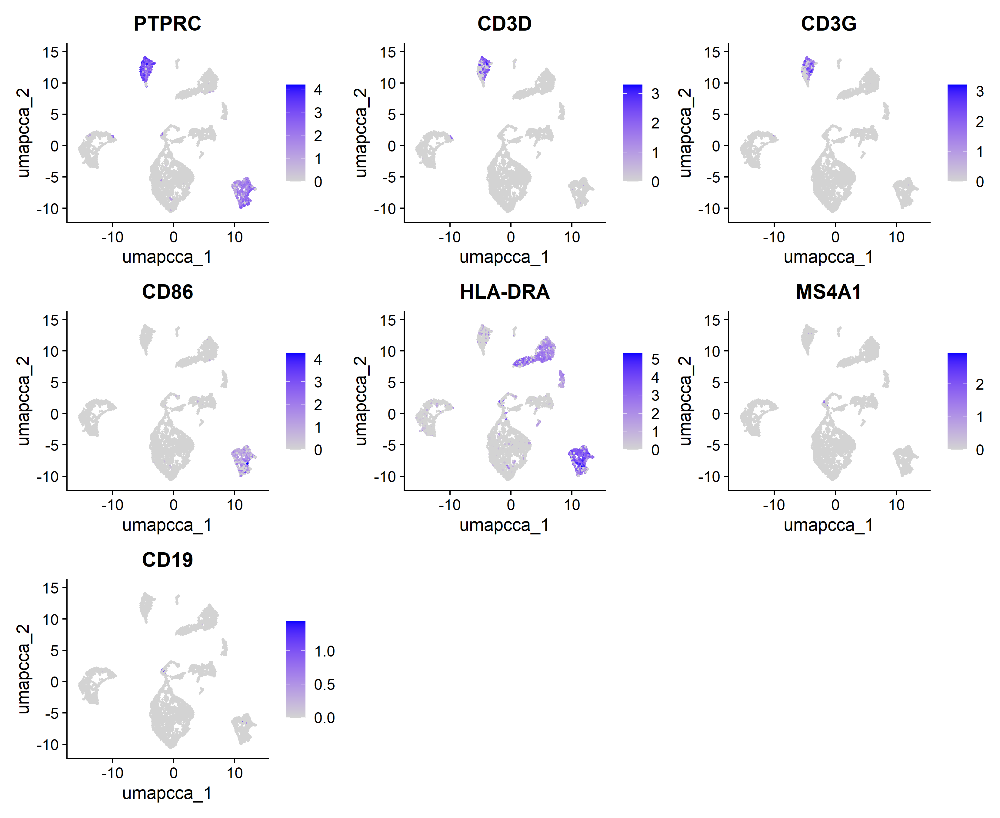

``` r
FeaturePlot(myometrium, features = c('ACTA2', 'MKI67', 'CNN1', 'CD34', 'GJA1', 'KCNN3'), reduction = 'umap.cca')
```

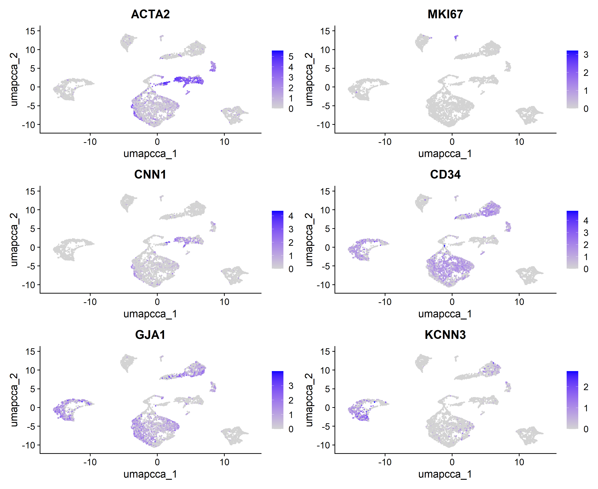

``` r
FeaturePlot(myometrium, features = c('VIM', 'PECAM1', 'LYVE1', 'PROX1', 'DCN'), reduction = 'umap.cca')
```

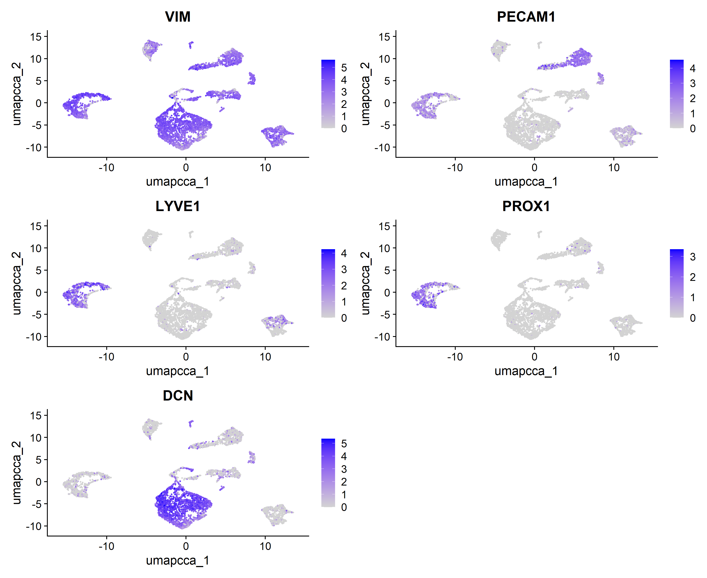

## Labelling the clusters

``` r
myometrium <- RenameIdents(object = myometrium,
                         '0' = 'ECs',
                         '1' = 'Stromal',
                         '2' = 'ICCs',
                         '3' = 'Stromal',
                         '4' = 'Stromal',
                         '5' = 'T Cells',
                         '6' = 'Stromal',
                         '7' = 'Macrophages',
                         '8' = 'ECs',
                         '9' = 'Myocytes',
                         '10' = 'Stromal',
                         '11' = 'Macrophages',
                         '12' = 'Lymphatic ECs', 
                         '13' = 'Stromal',
                         '14' = 'T Cells',
                         '15' = 'Myocytes', 
                         '16' = 'Macrophages',
                         '17' = 'ECs', 
                         '18' = 'Lymphatic ECs',
                         '19' = 'Stromal',
                         '20' = 'Stromal',
                         '21' = 'Myocytes',
                         '22' = 'Lymphatic ECs',
                         '23' = 'Proliferative',
                         '24' = 'Myocytes')
myometrium$cluster.ident <- Idents(myometrium)

#Making DotPlot
DotPlot_scCustom(myometrium, dot.scale = 7, features = c('ACTA2', 'CNN1', 'CD34', 'GJA1', 'KCNN3', 'MKI67', 'PECAM1', 'LYVE1', 'PROX1', 'DCN', 'VIM',
                                                       'PTPRC', 'CD3D', 'CD3G', 'CD86', 'HLA-DRA'),
                 assay = 'RNA', remove_axis_titles = T, colors_use = palette.go(4)) + theme(axis.text.x = 
                                                                                              element_text(angle = 45, face = 'italic', vjust = 1, hjust = 1, size = 20),
                                                                                            axis.text.y = element_text(angle = 0, hjust = 0.5, size = 20))
```

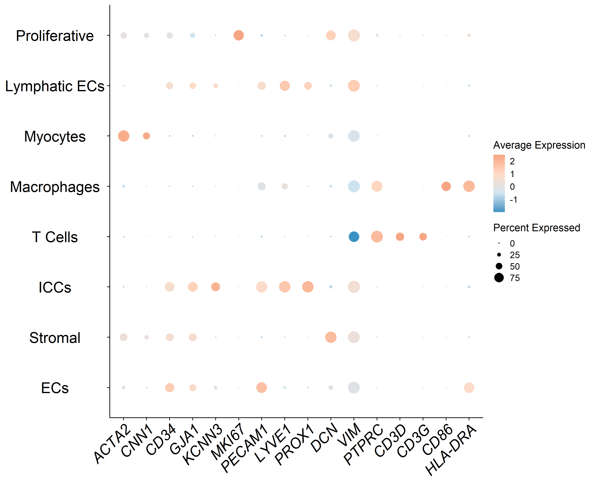

``` r
p5 <- DimPlot(myometrium, reduction = 'umap.cca') + ggtitle('Integrated UMAP') + theme(legend.text = element_text(size = 10))
p6 <- DimPlot(myometrium, reduction = 'umap.cca', group.by = 'orig.ident', shuffle = T) + ggtitle('Integrated UMAP')
p7 <- DimPlot(myometrium, reduction = 'umap') + ggtitle('Unintegrated UMAP') + theme(legend.text = element_text(size = 10))
p8 <- DimPlot(myometrium, reduction = 'umap', group.by = 'orig.ident', shuffle = T) + ggtitle('Unintegrated UMAP')
p5 + p6 
```

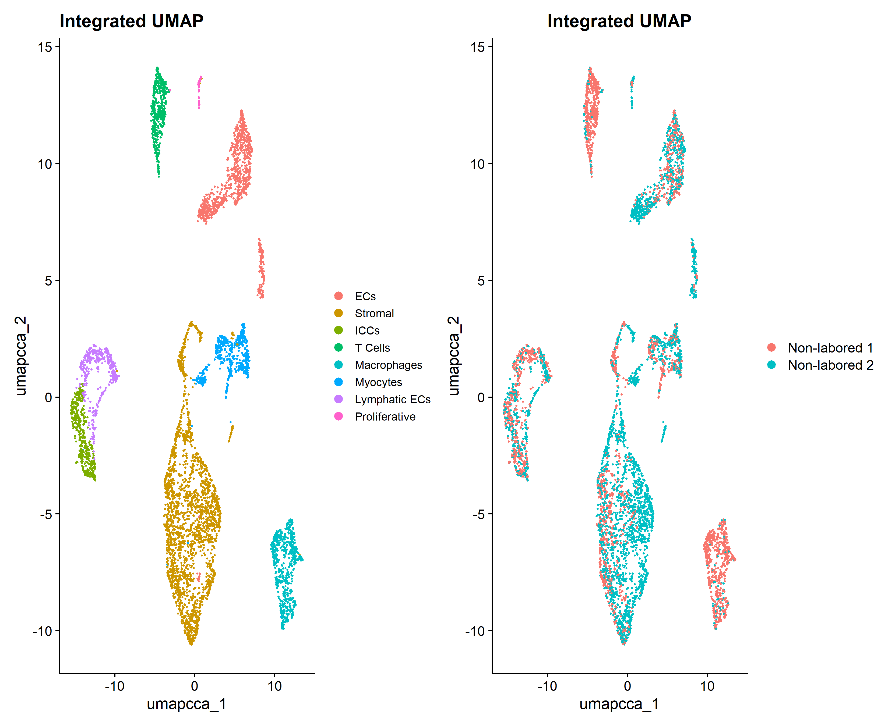

``` r
p7 + p8
```

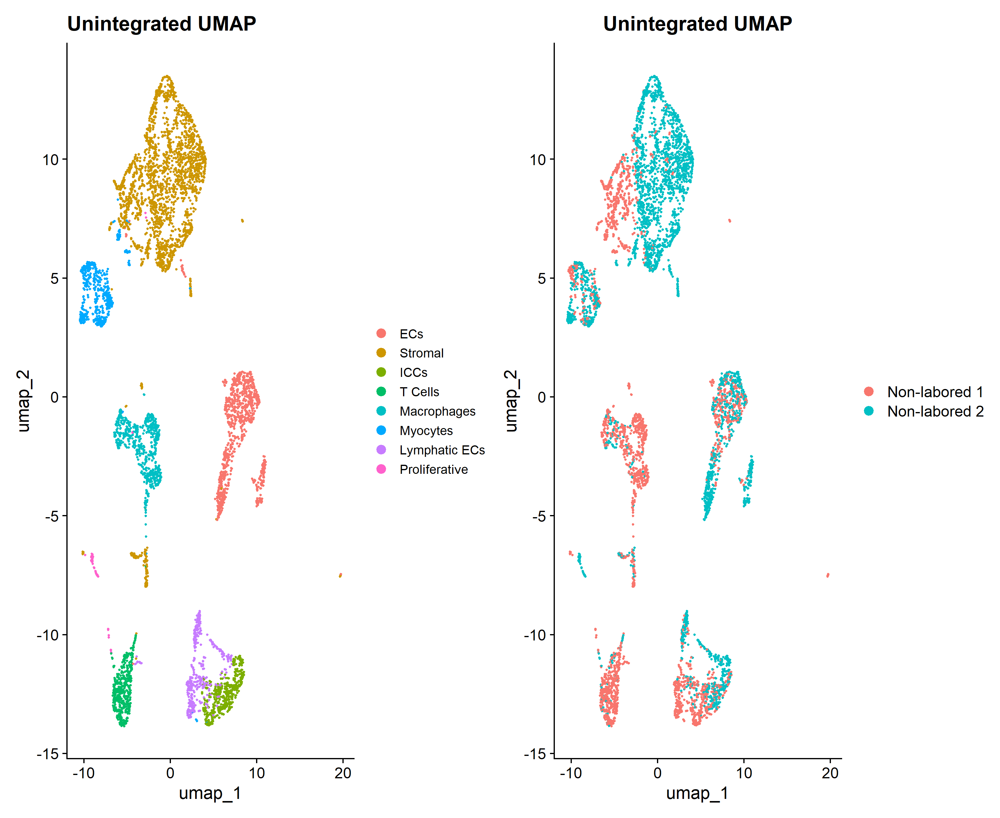

# Workflow for the basal plate sn dataset

## Making Seurat objects

``` r
#Creating Seurat Objects
nuc_020325 <- CreateSeuratObject(counts = nuc_020325.data, project = 'Labored 1', min.cells = 3, min.features = 100)
nuc_052725 <- CreateSeuratObject(counts = nuc_052725.data, project = 'Labored 4', min.cells = 3, min.features = 100)
nuc_022025 <- CreateSeuratObject(counts = nuc_022025.data, project = 'Labored 3', min.cells = 3, min.features = 100)
nuc_021125 <- CreateSeuratObject(counts = nuc_021125.data, project = 'Labored 2', min.cells = 3, min.features = 100)
nuc_25_7 <- CreateSeuratObject(counts = nuc_25_7.data, project = 'Non-labored 2', min.cells = 3, min.features = 100)
nuc_25_6 <- CreateSeuratObject(counts = nuc_25_6.data, project = 'Non-labored 1', min.cells = 3, min.features = 100)

#Merging objects
nuclei <- merge(x = nuc_020325, y = c(nuc_052725, nuc_022025, nuc_021125, nuc_25_7, nuc_25_6))
```

## Filtering the data

``` r
#Filtering the data
nuclei[['percent.mt']] <- PercentageFeatureSet(nuclei, pattern = '^MT-')
p1 <- VlnPlot(nuclei, features = c('nFeature_RNA', 'nCount_RNA', 'percent.mt'), group.by = 'orig.ident')
p1
```

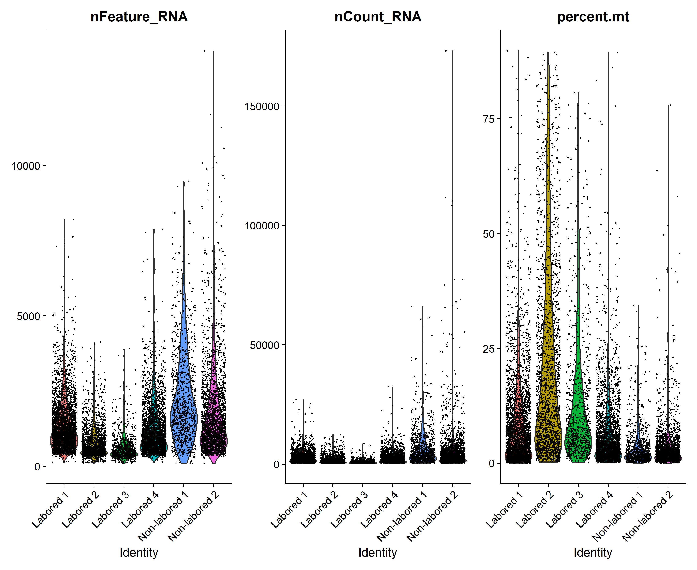

``` r
nuclei <- subset(nuclei, subset = nFeature_RNA > 200 & nFeature_RNA < 10000 & percent.mt < 10)
p2 <- VlnPlot(nuclei, features = c('nFeature_RNA', 'nCount_RNA', 'percent.mt'), group.by = 'orig.ident')
p2
```

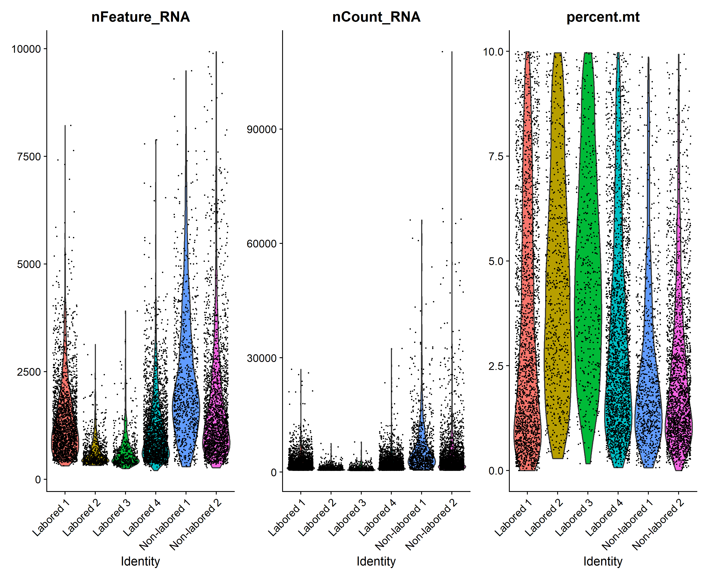

## Processing the data

``` r
#Pre-processing
nuclei <- NormalizeData(nuclei, normalization.method = 'LogNormalize', scale.factor = 10000)
nuclei <- FindVariableFeatures(nuclei, selection.method = 'vst', nfeatures = 2000)
top10 <- head(VariableFeatures(nuclei), 10)
p3 <- LabelPoints(plot = VariableFeaturePlot(nuclei), points = top10, repel = T)
p3
```

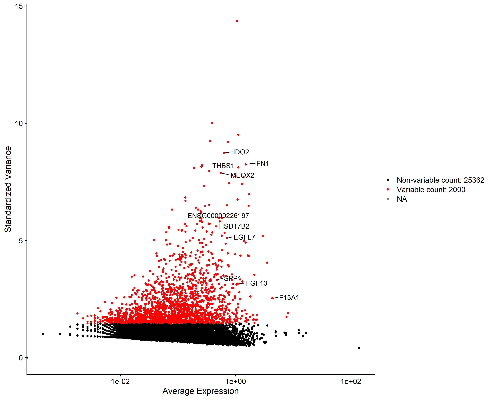

``` r
#Scaling the data
all.genes <- rownames(nuclei)
nuclei <- ScaleData(nuclei, features = all.genes)

#PCA
nuclei <- RunPCA(nuclei, features = VariableFeatures(object = nuclei))
p4 <- ElbowPlot(nuclei)
p4
```

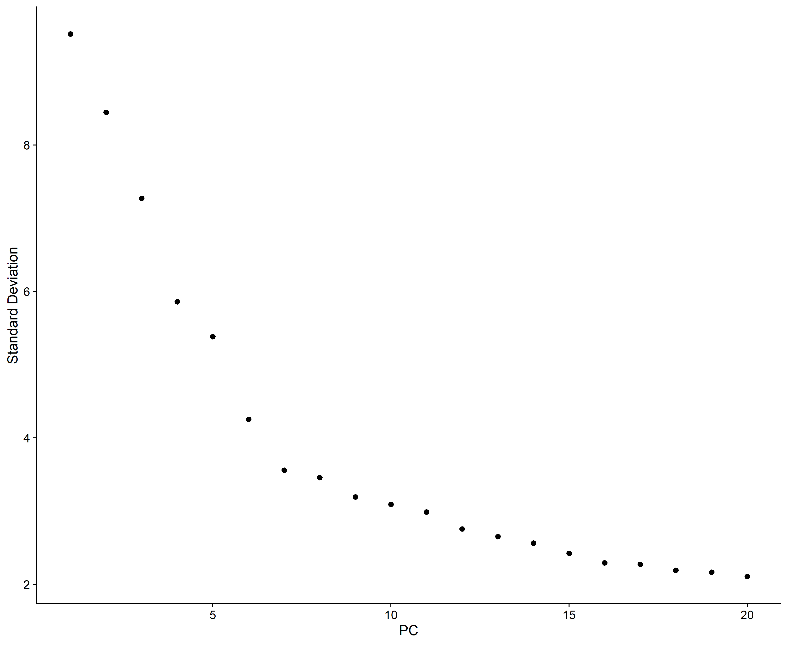

## Making the UMAP

``` r
#Making the UMAP
nuclei <- FindNeighbors(nuclei, dims = 1:15)
nuclei <- FindClusters(nuclei, resolution = 1)
```

    ## Modularity Optimizer version 1.3.0 by Ludo Waltman and Nees Jan van Eck
    ## 
    ## Number of nodes: 8920
    ## Number of edges: 307917
    ## 
    ## Running Louvain algorithm...
    ## Maximum modularity in 10 random starts: 0.8791
    ## Number of communities: 23
    ## Elapsed time: 0 seconds

``` r
nuclei <- RunUMAP(nuclei, dims = 1:15)
```

## Integrating the data

``` r
#Integrating Layers
nuclei <- IntegrateLayers(nuclei, method = CCAIntegration, orig.reduction = 'pca', new.reduction = 'integrated.cca')
nuclei[['RNA']] <- JoinLayers(nuclei[['RNA']])

#'[MAKE SURE THAT YOU USE INTEGRATED.CCA AS YOUR REDUCTION METHODS FROM NOW ON!!!]
nuclei <- FindNeighbors(nuclei, reduction = "integrated.cca", dims = 1:15)
nuclei <- FindClusters(nuclei, resolution = 0.8, cluster.name = "cca_clusters")
```

    ## Modularity Optimizer version 1.3.0 by Ludo Waltman and Nees Jan van Eck
    ## 
    ## Number of nodes: 8920
    ## Number of edges: 336246
    ## 
    ## Running Louvain algorithm...
    ## Maximum modularity in 10 random starts: 0.8630
    ## Number of communities: 15
    ## Elapsed time: 0 seconds

``` r
#Making the UMAp for integrated layers
nuclei <- RunUMAP(nuclei, reduction = 'integrated.cca', dims = 1:15, reduction.name = 'umap.cca')
```

## Checking integration

``` r
p5 <- DimPlot(nuclei, reduction = 'umap.cca', label = T) + NoLegend() + ggtitle('Integrated UMAP')
p6 <- DimPlot(nuclei, reduction = 'umap.cca', group.by = 'orig.ident', shuffle = T) + ggtitle('Integrated UMAP')
p7 <- DimPlot(nuclei, reduction = 'umap', label = T) + NoLegend() + ggtitle('Unintegrated UMAP')
p8 <- DimPlot(nuclei, reduction = 'umap', group.by = 'orig.ident', shuffle = T) + ggtitle('Unintegrated UMAP')
p5 + p6 + p7 + p8
```

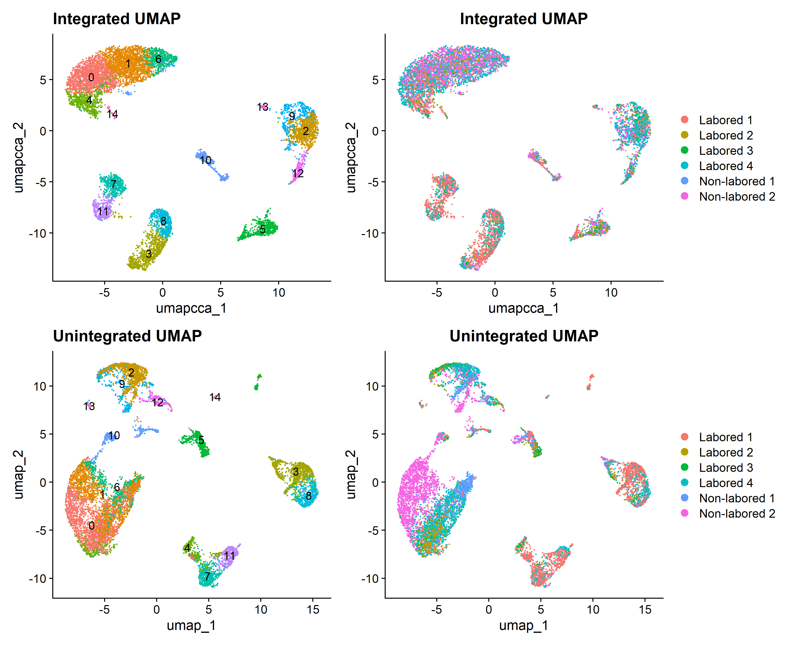

## Seeing cluster contribution by sample

``` r
p9 <- DimPlot(nuclei, reduction = 'umap.cca', split.by = 'orig.ident')
p9
```

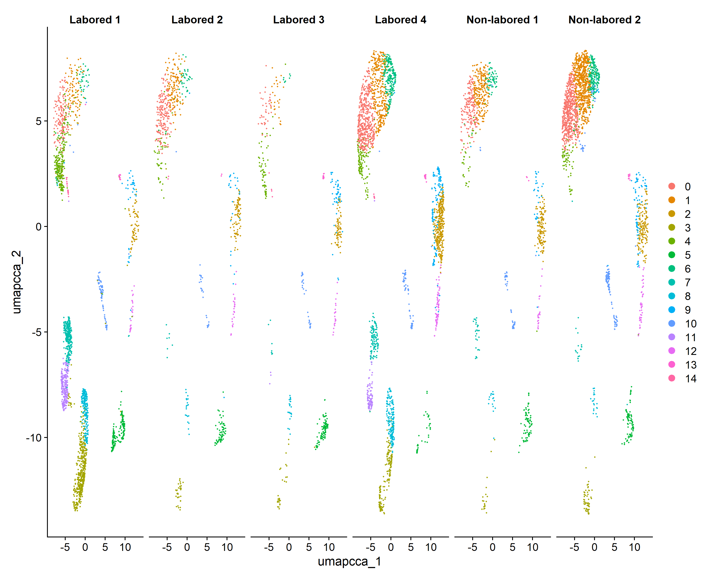

``` r
p10 <- DimPlot(nuclei, reduction = 'umap', split.by = 'orig.ident')
p10
```

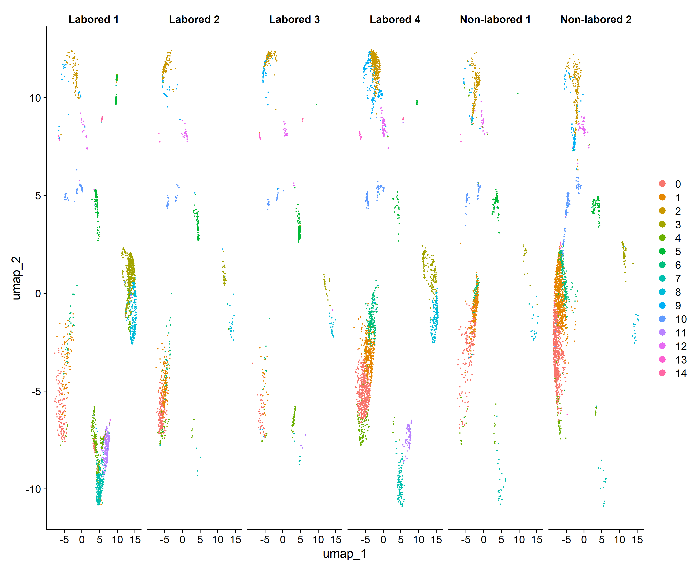

## Cluster identification

``` r
FeaturePlot(nuclei, features = c('PTPRC', 'CD86', 'CD74', 'HLA-DRA', 'CD3D', 'CD3G'),  reduction = 'umap.cca')
```

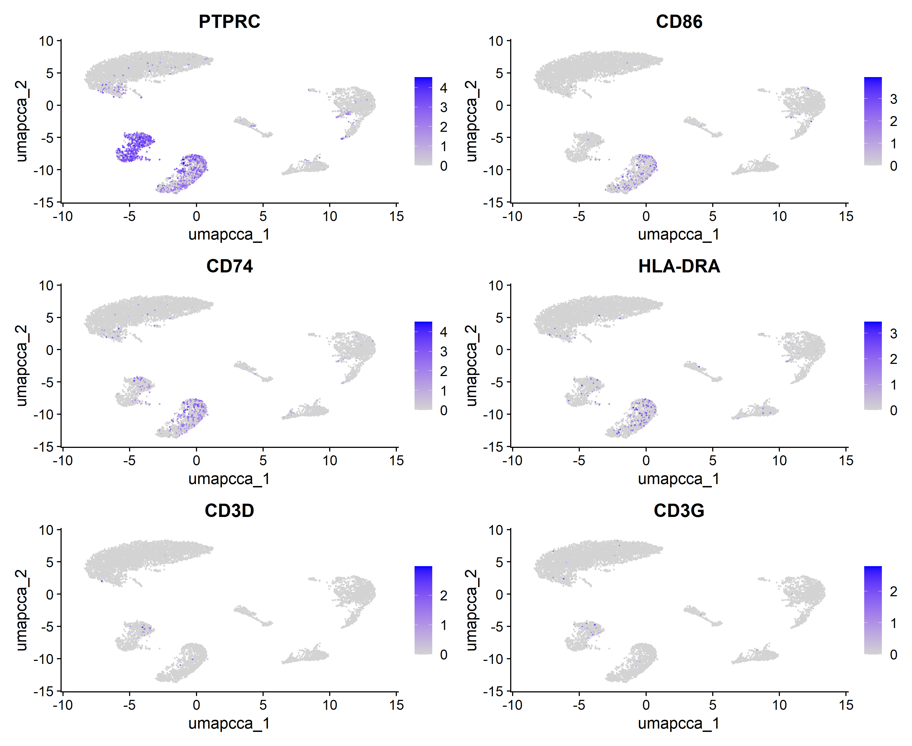

``` r
FeaturePlot(nuclei, features = c('PAPPA', 'CSH2', 'SDC1', 'GATA3', 'ITGA6', 'TEAD4'),  reduction = 'umap.cca')
```

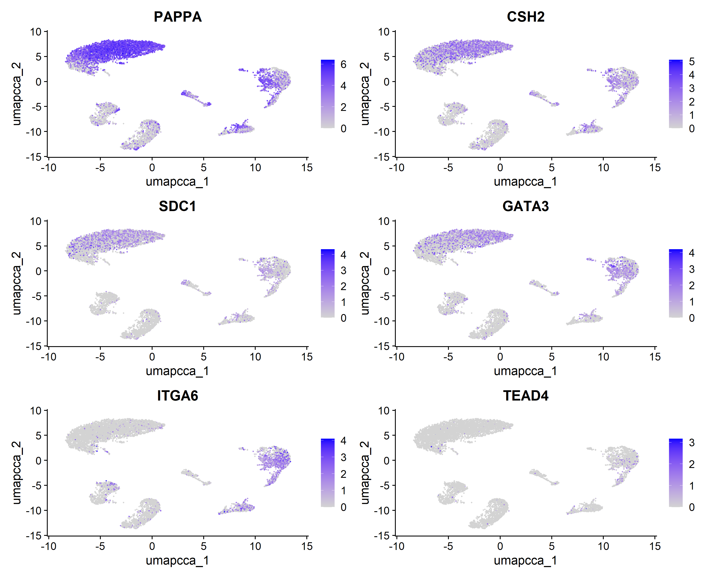

``` r
FeaturePlot(nuclei, features = c('PECAM1', 'MKI67', 'ERVW-1', 'ERVFRD-1'),  reduction = 'umap.cca')
```

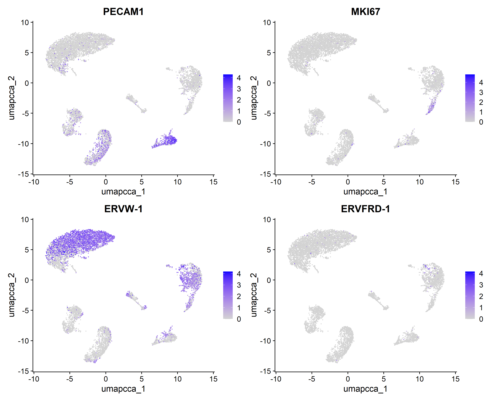

## Cluster labeling

``` r
nuclei <- RenameIdents(object = nuclei,
                         '0' = 'ST',
                         '1' = 'ST',
                         '2' = 'pCTs',
                         '3' = 'Macrophages',
                         '4' = 'ST',
                         '5' = 'ECs',
                         '6' = 'ST',
                         '7' = 'Hofbauer Cells',
                         '8' = 'Macrophages',
                         '9' = 'Fus. Comp. CTs',
                         '10' = 'Early ST',
                         '11' = 'Hofbauer Cells',
                         '12' = 'Prolif. CTs', 
                         '13' = 'Fus. Comp. CTs',
                         '14' = 'ST')
                         
nuclei$cluster.ident <- Idents(nuclei)

#Making the DotPLot
DotPlot_scCustom(nuclei, dot.scale = 10, features = c('SDC1', 'PAPPA', 'CSH2','ITGA6','TEAD4','GATA3', 'MKI67', 
                                                        'ERVW-1','ERVFRD-1', 'PECAM1', 'PTPRC', 'CD86', 'HLA-DRA', 'ITGAM'),
                 assay = 'RNA', remove_axis_titles = T, colors_use = palette.go(4)) + theme(axis.text.x = 
                                                                                              element_text(angle = 45, face = 'italic', vjust = 1, hjust = 1, size = 20),
                                                                                            axis.text.y = element_text(angle = 0, hjust = 0.5, size = 20))
```

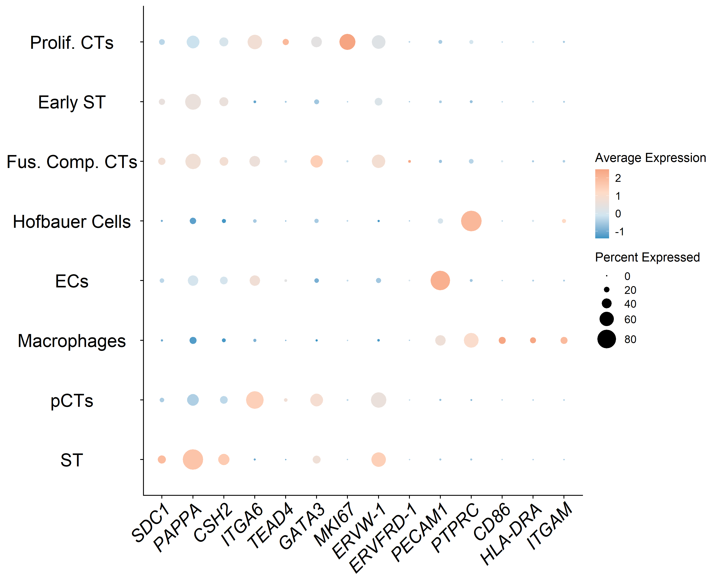

``` r
p5 <- DimPlot(nuclei, reduction = 'umap.cca') + ggtitle('Integrated UMAP') + theme(legend.text = element_text(size = 10))
p6 <- DimPlot(nuclei, reduction = 'umap.cca', group.by = 'orig.ident', shuffle = T) + ggtitle('Integrated UMAP')
p7 <- DimPlot(nuclei, reduction = 'umap') + ggtitle('Unintegrated UMAP') + theme(legend.text = element_text(size = 10))
p8 <- DimPlot(nuclei, reduction = 'umap', group.by = 'orig.ident', shuffle = T) + ggtitle('Unintegrated UMAP')
p5 + p6 
```

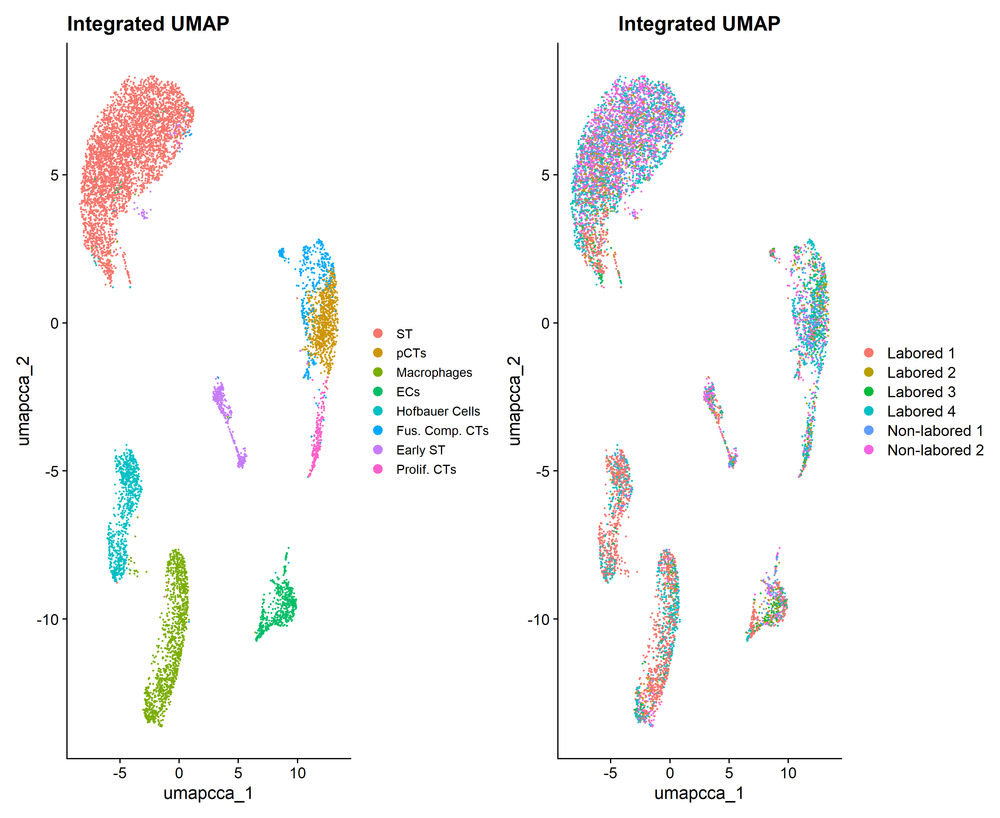

``` r
p7 + p8
```

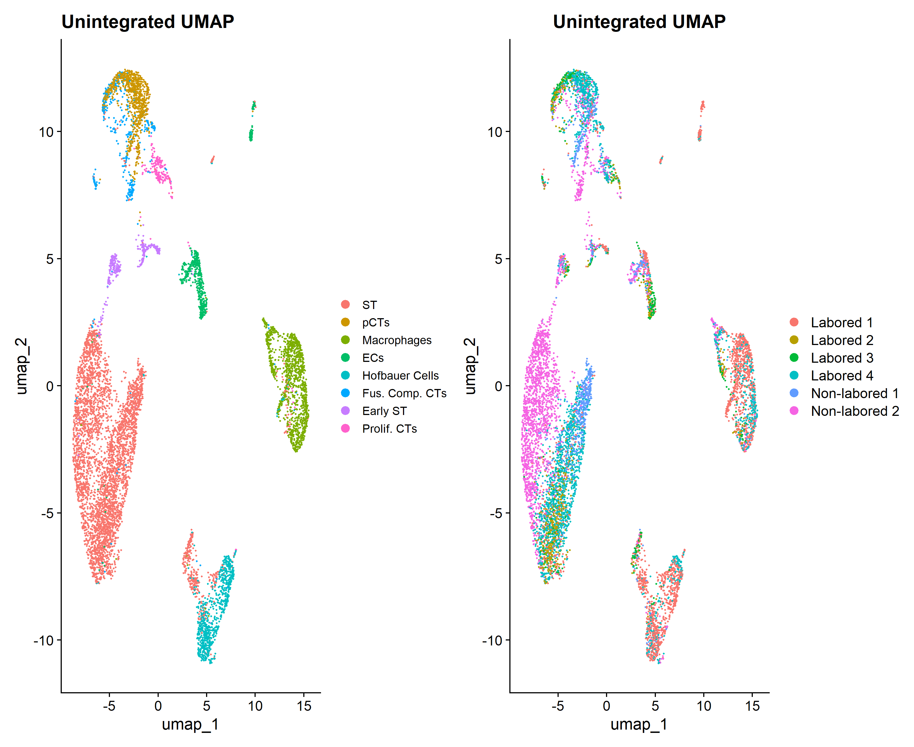

\#Integrating all datasets

\#Processing data

``` r
#Merging the datasets
integrated <- merge(x= basal_plate, y = c(myometrium, membrane, nuclei))

#Pre-processing
integrated <- NormalizeData(integrated, normalization.method = 'LogNormalize', scale.factor = 10000)
integrated <- FindVariableFeatures(integrated, selection.method = 'vst', nfeatures = 2000)
top10 <- head(VariableFeatures(integrated), 10)
LabelPoints(plot = VariableFeaturePlot(integrated), points = top10, repel = T)
```

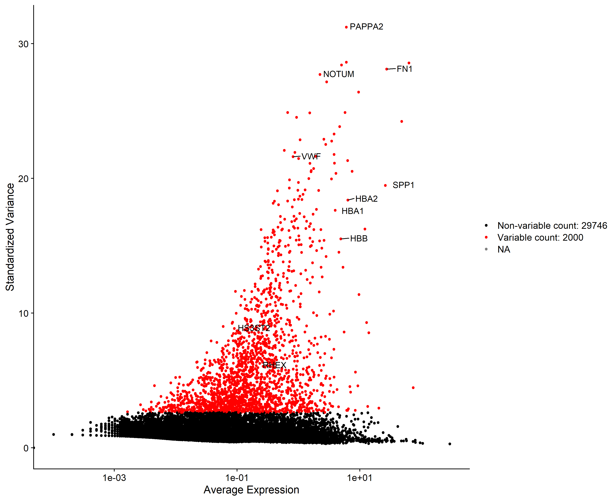

``` r
#Scaling the data
all.genes <- rownames(integrated)
integrated <- ScaleData(integrated, features = all.genes)

#PCA
integrated <- RunPCA(integrated, features = VariableFeatures(object = integrated))
ElbowPlot(integrated)
```

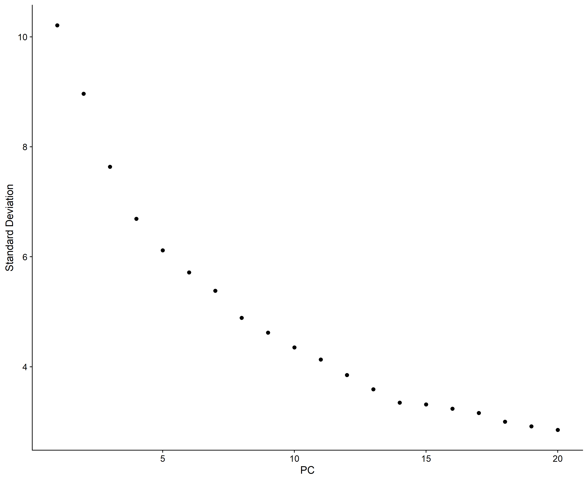

``` r
#Making the UMAP
integrated <- FindNeighbors(integrated, dims = 1:15)
integrated <- FindClusters(integrated, resolution = 1)
```

    ## Modularity Optimizer version 1.3.0 by Ludo Waltman and Nees Jan van Eck
    ## 
    ## Number of nodes: 44483
    ## Number of edges: 1506892
    ## 
    ## Running Louvain algorithm...
    ## Maximum modularity in 10 random starts: 0.9311
    ## Number of communities: 42
    ## Elapsed time: 3 seconds

``` r
integrated <- RunUMAP(integrated, dims = 1:15)

#Integrating the layers
integrated <- IntegrateLayers(integrated, method = CCAIntegration, orig.reduction = 'pca', new.reduction = 'integrated.cca')
integrated[['RNA']] <- JoinLayers(integrated[['RNA']])

#'[MAKE SURE THAT YOU USE INTEGRATED.CCA AS YOUR REDUCTION METHODS FROM NOW ON!!!]
integrated <- FindNeighbors(integrated, reduction = "integrated.cca", dims = 1:15)
integrated <- FindClusters(integrated, resolution = 0.8, cluster.name = "cca_clusters")
```

    ## Modularity Optimizer version 1.3.0 by Ludo Waltman and Nees Jan van Eck
    ## 
    ## Number of nodes: 44483
    ## Number of edges: 1531754
    ## 
    ## Running Louvain algorithm...
    ## Maximum modularity in 10 random starts: 0.9280
    ## Number of communities: 32
    ## Elapsed time: 4 seconds

``` r
#Making the UMAp for integrated layers
integrated <- RunUMAP(integrated, reduction = 'integrated.cca', dims = 1:15, reduction.name = 'umap.cca')

p1 <- DimPlot(integrated, reduction = 'umap.cca', label = T) + NoLegend() + ggtitle('Integrated UMAP')
p2 <- DimPlot(integrated, reduction = 'umap.cca', group.by = 'orig.ident', shuffle = T) + ggtitle('Integrated UMAP by sample')
p3 <- DimPlot(integrated, reduction = 'umap', label = T) + NoLegend() + ggtitle('Unintegrated UMAP')
p4 <- DimPlot(integrated, reduction = 'umap', group.by = 'orig.ident', shuffle = T) + ggtitle('Unintegrated UMAP by sample')
p1 + p2 + p3 + p4
```

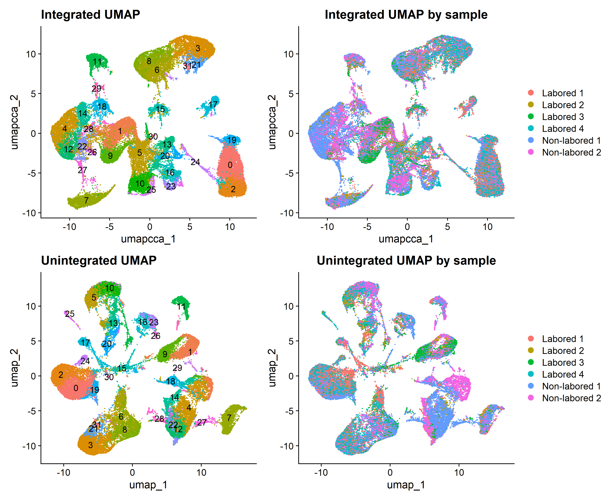

\#Cluster Identification

``` r
#Clustering labelling
FeaturePlot(integrated, features = c('PTPRC', 'CD3D', 'CD3G', 'CD86', 'CD74', 'HLA-DRA'), reduction = 'umap.cca')
```

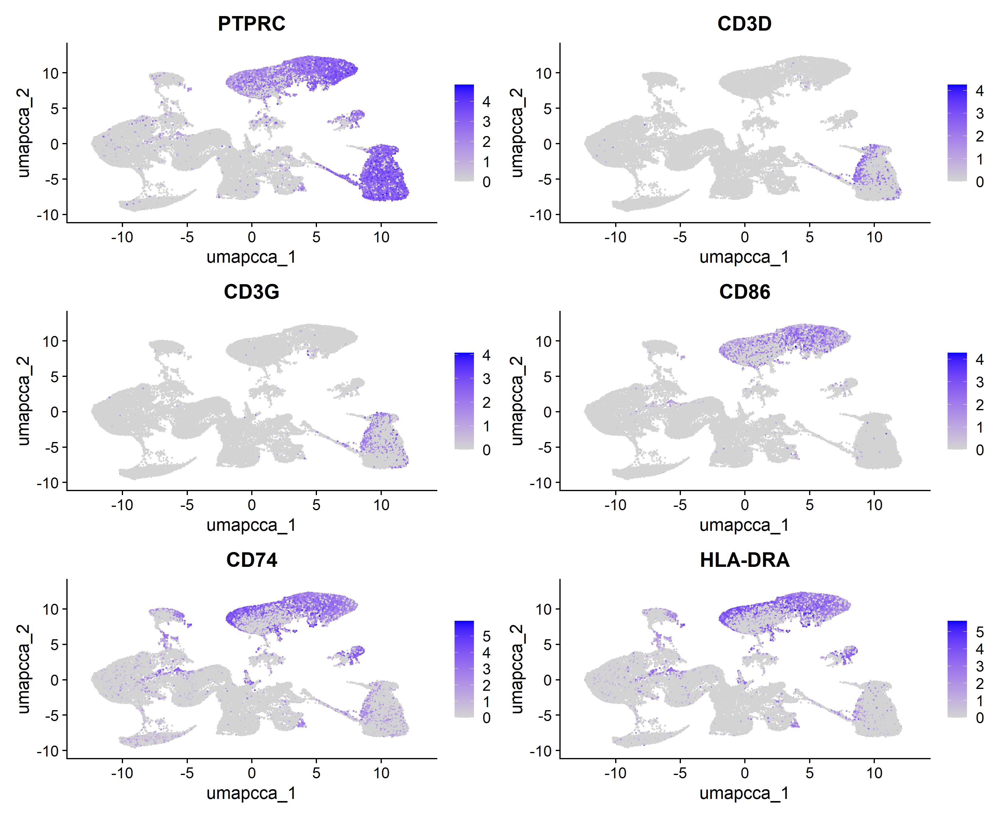

``` r
FeaturePlot(integrated, features = c('PTPRC', 'EOMES', 'NCR1', 'MS4A1', 'CD19'), reduction = 'umap.cca')
```

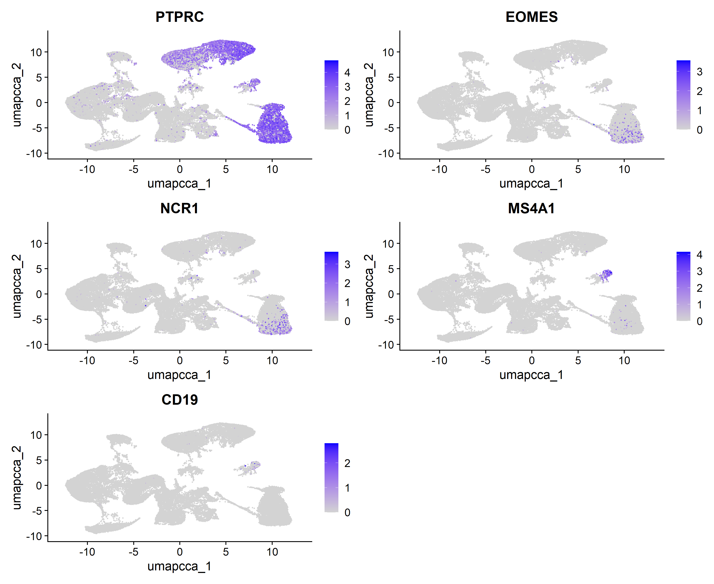

``` r
FeaturePlot(integrated, features = c('PECAM1', 'PROX1', 'LYVE1', 'GP9', 'ITGA2B', 'GP1BA'), reduction = 'umap.cca')
```

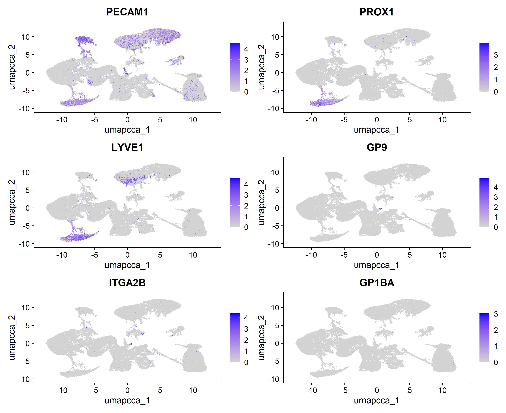

``` r
FeaturePlot(integrated, features = c('PAPPA', 'SDC1', 'CSH2', 'ERVW-1', 'ERVFRD-1', 'GATA3'), reduction = 'umap.cca')
```

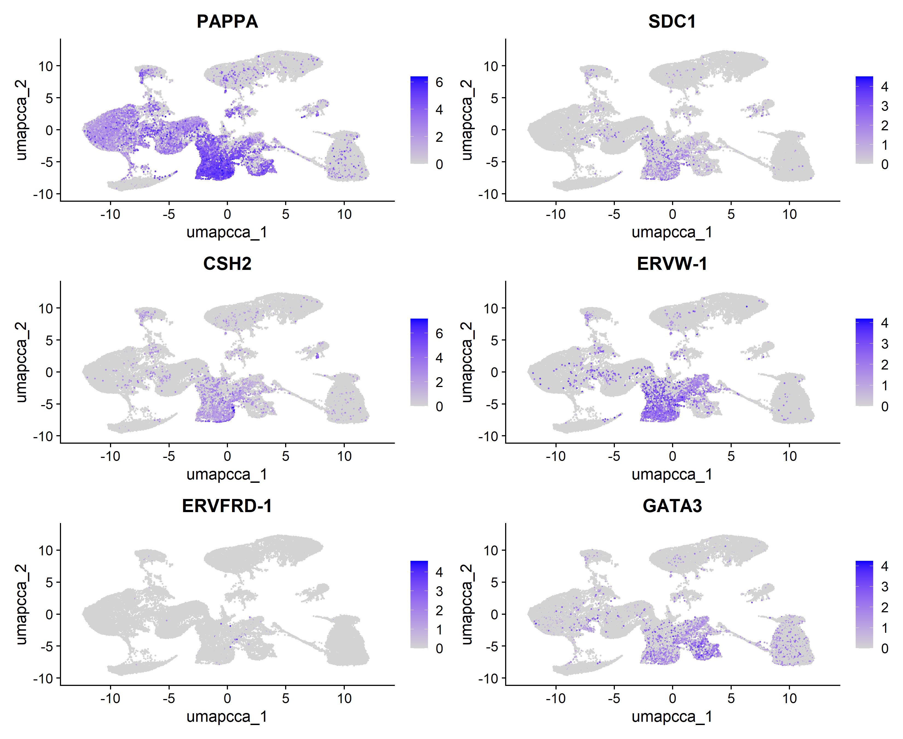

``` r
FeaturePlot(integrated, features = c('GATA3', 'TEAD4', 'ITGA6', 'MKI67', 'HLA-G', 'NOTCH2'), reduction = 'umap.cca')
```

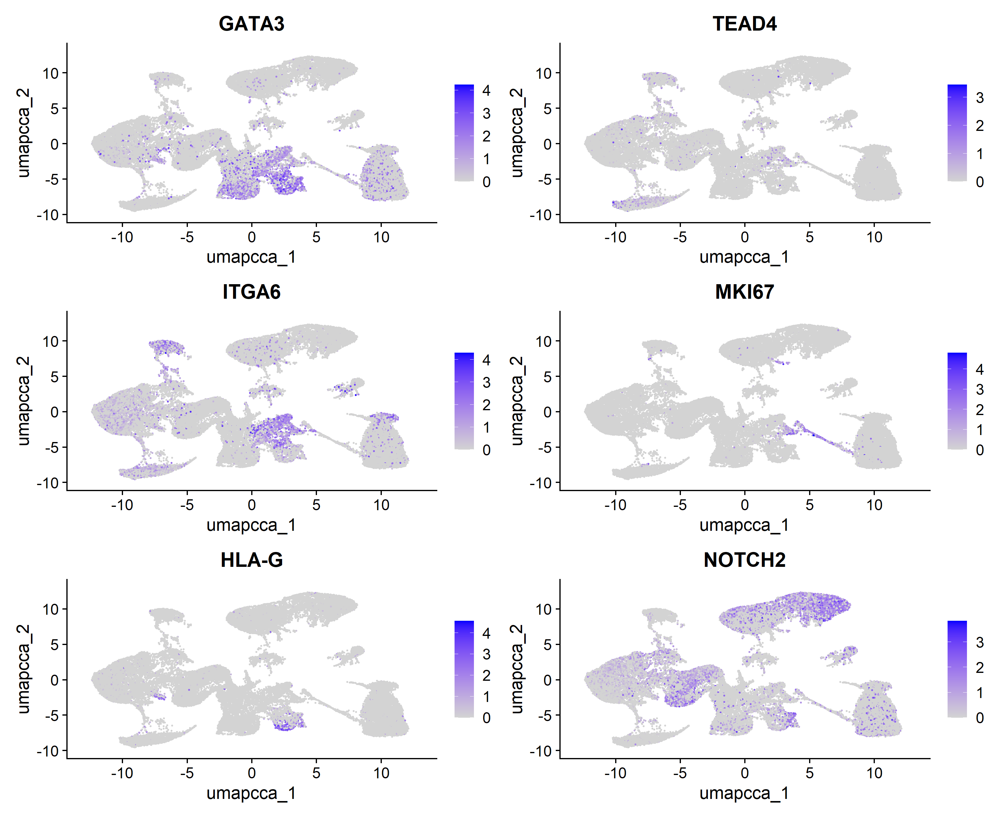

``` r
FeaturePlot(integrated, features = c('ACTA2', 'CNN1', 'CD34', 'GJA1', 'KCNN3'), reduction = 'umap.cca')
```

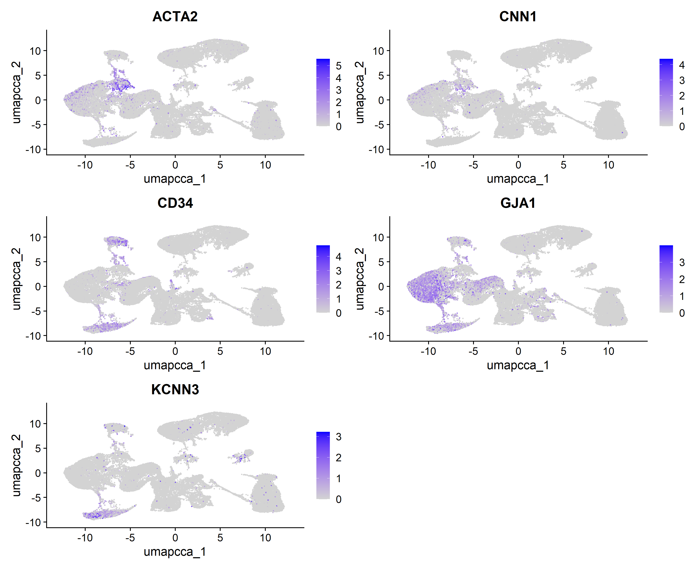

``` r
FeaturePlot(integrated, features = c('PRL', 'IGFBP1', 'DCN', 'IGF1', 'PGR', 'HAND2'), reduction = 'umap.cca')
```

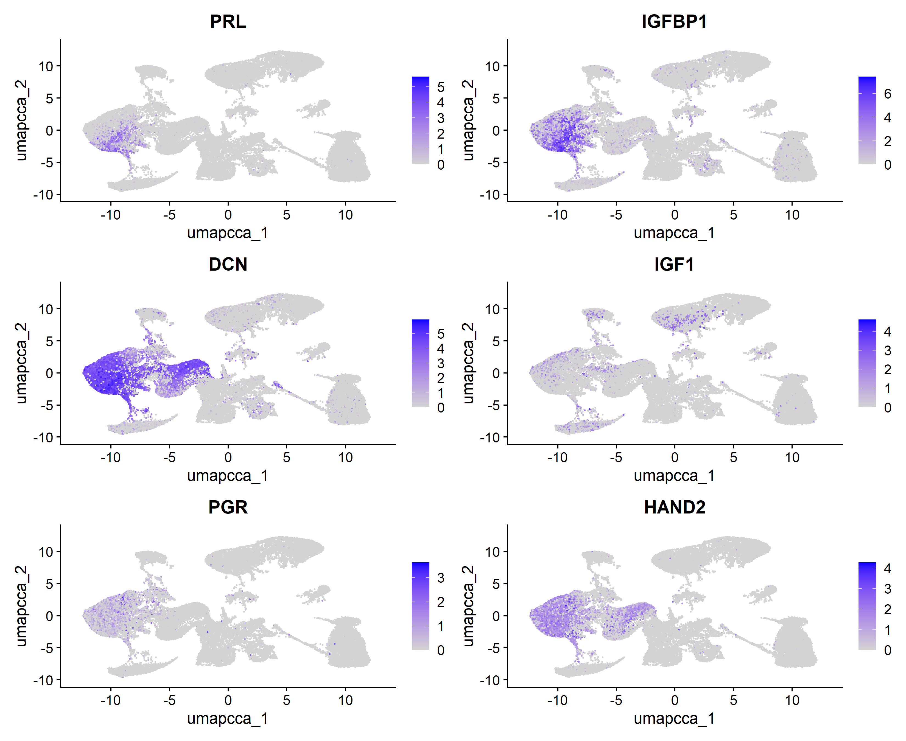

``` r
FeaturePlot(integrated, features = c('DCN', 'KRT19', 'KRT7', 'CDH1', 'HLA-G', 'PECAM1'), reduction = 'umap.cca')
```

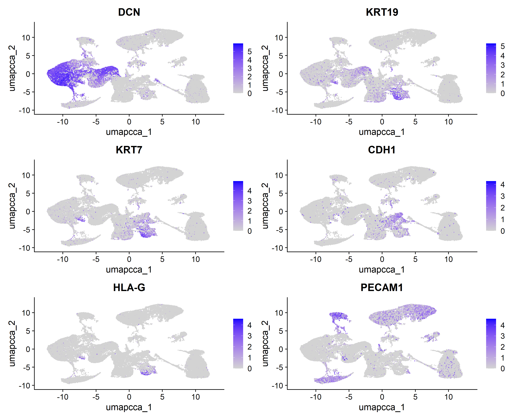

``` r
#Subsetting the dataset
integrated <- RenameIdents(object = integrated,
                         '0' = 'T Cells',
                         '1' = 'Stromal 1',
                         '2' = 'NK Cells',
                         '3' = 'Macrophages',
                         '4' = 'Decidualizing Cells',
                         '5' = 'Fus. Comp. CTs',
                         '6' = 'Hofbauer Cells',
                         '7' = 'Lymphatic ECs',
                         '8' = 'Macrophages',
                         '9' = 'Stromal 2',
                         '10' = 'ST',
                         '11' = 'ECs',
                         '12' = 'Decidualized Cells', 
                         '13' = 'pCTs',
                         '14' = 'Stromal 3',
                         '15' = 'Dendritic Cells', 
                         '16' = 'Epithelial Cells',
                         '17' = 'B Cells', 
                         '18' = 'Myocytes',
                         '19' = 'T Cells',
                         '20' = 'Early ST',
                         '21' = 'Macrophages',
                         '22' = 'Decidualized Cells',
                         '23' = 'EVTs/Chorionic Trophoblasts', 
                         '24' = 'Proliferative', 
                         '25' = 'ST',
                         '26' = 'Decidualized Cells', 
                         '27' = 'Lymphatic ECs',
                         '28' = 'Stromal 4',
                         '29' = 'ICCs', 
                         '30' = 'Megakaryocytes',
                         '31' = 'Macrophages')
integrated$cluster.ident <- Idents(integrated)
```

\#Checking labelled UMAPs

``` r
p5 <- DimPlot(integrated, reduction = 'umap.cca') + ggtitle('Integrated UMAP') + theme(legend.text = element_text(size = 10))
p6 <- DimPlot(integrated, reduction = 'umap.cca', group.by = 'orig.ident', shuffle = T) + ggtitle('Integrated UMAP')
p7 <- DimPlot(integrated, reduction = 'umap') + ggtitle('Unintegrated UMAP') + theme(legend.text = element_text(size = 10))
p8 <- DimPlot(integrated, reduction = 'umap', group.by = 'orig.ident', shuffle = T) + ggtitle('Unintegrated UMAP')
p5 + p6 
```

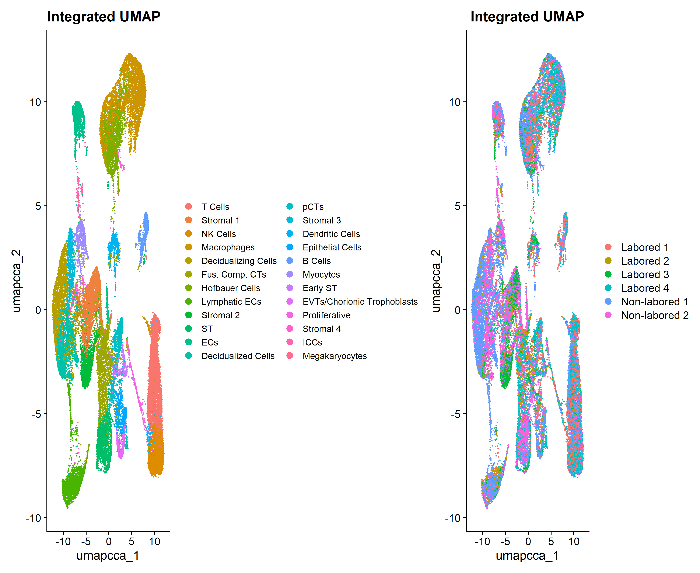

``` r
p7 + p8
```

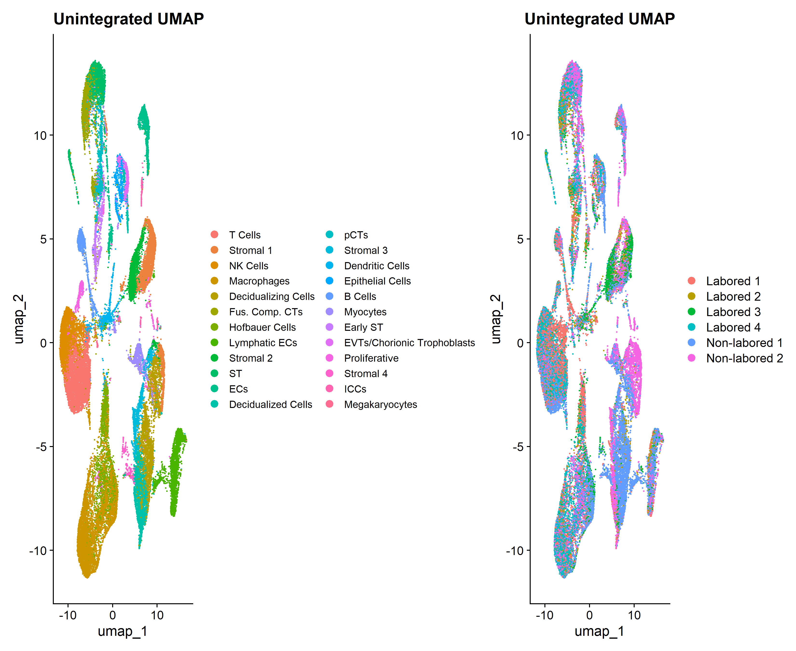

``` r
#Making the DotPlot
DotPlot_scCustom(integrated, dot.scale = 7, features = c('PTPRC', 'CD3D', 'CD3G', 'CD86', 'HLA-DRA', 'NCR1', 'MS4A1', 'CD19', 
                                                       'PECAM1', 'PROX1', 'GP9', 'GP1BA', 'PAPPA', 'SDC1', 'ERVW-1', 'ERVFRD-1', 
                                                       'GATA3', 'ITGA6', 'MKI67', 'HLA-G', 'NOTCH2', 'ACTA2', 'CNN1', 'GJA1', 'KCNN3',
                                                       'DCN', 'PRL', 'IGFBP1', 'IGF1', 'PGR', 'HAND2', 'KRT19','KRT7', 'CDH1'),
                 assay = 'RNA', remove_axis_titles = T, colors_use = palette.go(4)) + theme(axis.text.x = 
                                                                                              element_text(angle = 45, face = 'italic', vjust = 1, hjust = 1, size = 20),
                                                                                            axis.text.y = element_text(angle = 0, hjust = 0.5, size = 20))
```

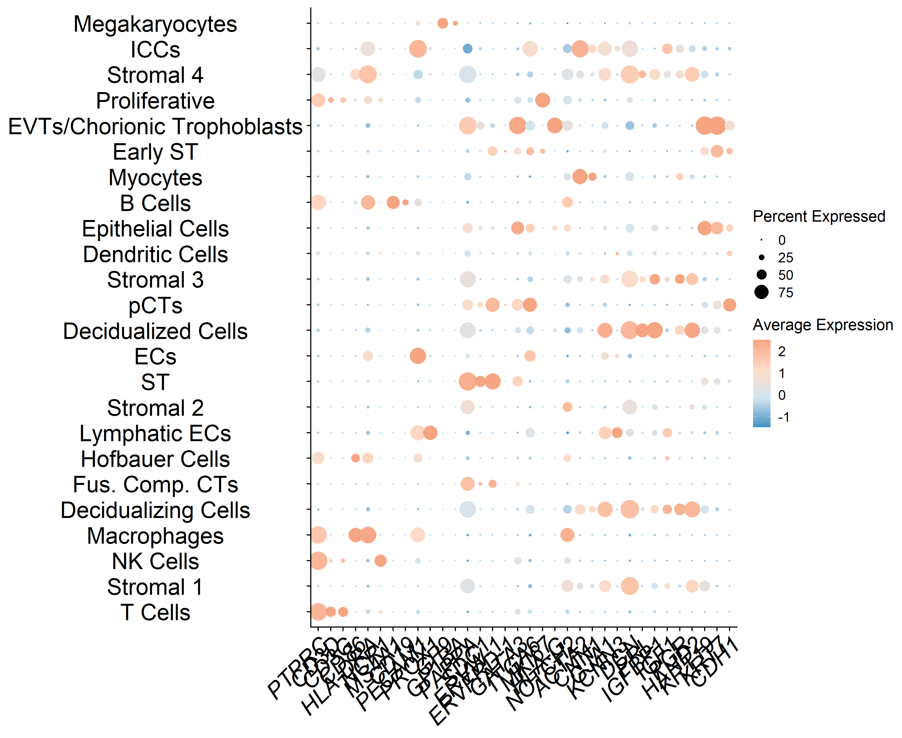
